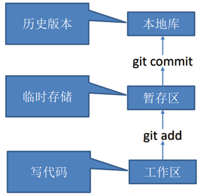
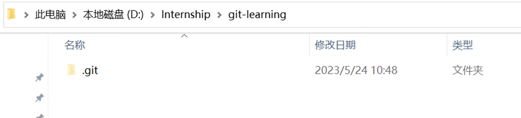
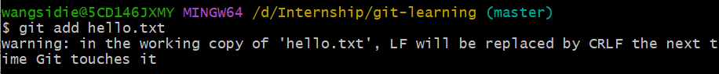
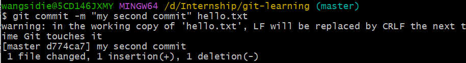
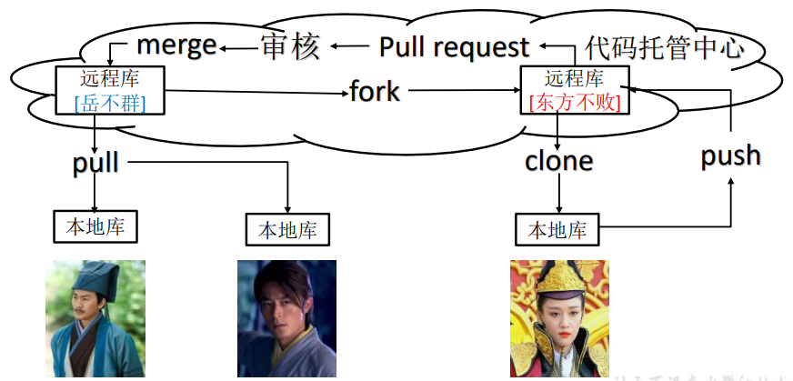

# Git学习笔记

## 1. Git 概述

​		Git 是一个免费的、开源的**分布式版本控制系统**，可以快速高效地处理从小型到大型的各种项目。 

### 1.1 何为版本控制

> 版本控制是一种记录文件内容变化，以便将来查阅特定版本修订情况的系统。
>
> 版本控制其实最重要的是可以记录文件修改历史记录，从而让用户能够查看历史版本， 方便版本切换。


### 1.2 为什么需要版本控制

​		个人开发过渡到团队协作。


### 1.3  版本控制工具

**集中式版本控制工具**

> ​		集中化的版本控制系统诸如 CVS、SVN 等，都有一个单一的集中管理的服务器，保存所有文件的修订版本，而协同工作的人们都通过客户端连到这台服务器，取出最新的文件或者提交更新。
>
> ​	优点：每个人都可以在一定程度上看到项目中的其他人正在做些什么。而管理员也可以轻松掌控每个开发者的权限，并且管理一个集中化的版本控制系统，要远比在各个客户端上维护本地数据库来得轻松容易。
>
> ​		缺点：中央服务器的单点故障。如果服务器宕机一小时，那么在这一小时内，谁都无法提交更新，也就无法协同工作。


**分布式版本控制工具**

> ​		像 Git 这种分布式版本控制工具，客户端提取的不是最新版本的文件快照，而是把代码仓库完整地镜像下来（本地库）。这样任何一处协同工作用的文件发生故障，事后都可以用 其他客户端的本地仓库进行恢复。因为每个客户端的每一次文件提取操作，实际上都是一次 对整个文件仓库的完整备份。 
>
> ​		分布式的版本控制系统出现之后,解决了集中式版本控制系统的缺陷: 
>
> 		1. 服务器断网的情况下也可以进行开发（因为版本控制是在本地进行的） 
> 		1. 每个客户端保存的也都是整个完整的项目（包含历史记录，更加安全）


### 1.4 Git工作机制



### 1.5 Git 和代码托管中心

代码托管中心是基于网络服务器的远程代码仓库，一般我们简单称为远程库。 

➢ 局域网 

​	✓ GitLab 

➢ 互联网 

​	✓ GitHub（外网） 

​	✓ Gitee 码云（国内网站）


## 2. Git 常用命令

| 命令名称                             | 作用           |
| ------------------------------------ | -------------- |
| git config --global user.name 用户名 | 设置用户签名   |
| git config --global user.email 邮箱  | 设置用户签名   |
| git init                             | 初始化本地库   |
| git status                           | 查看本地库状态 |
| git add 文件名                       | 添加到暂存区   |
| git commit -m "日志信息" 文件名      | 提交到本地库   |
| git reflog                           | 查看历史记录   |
| git reset --hard 版本号              | 版本穿梭       |

### 2.1 设置用户签名

#### （1）基本语法

```shell
git config --global user.name 用户名
git config --global user.email 邮箱
```

#### （2）案例实操

```shell
wangsidie@5CD146JXMY MINGW64 /d/Internship
$ git config --global user.name wangsidie

wangsidie@5CD146JXMY MINGW64 /d/Internship
$ git config --global user.email wangsidie@360.cn

wangsidie@5CD146JXMY MINGW64 /d/Internship
$ cat ~/.gitconfig
[user]
        name = wangsidie
        email = wangsidie@360.cn
[core]
        excludesfile = C:/Users/wangsidie/git.ignore
```


说明： 

​		签名的作用是区分不同操作者身份。用户的签名信息在每一个版本的提交信息中能够看到，以此确认本次提交是谁做的。**Git 首次安装必须设置一下用户签名，否则无法提交代码。** 

​		**※注意**：这里设置用户签名和将来登录 GitHub（或其他代码托管中心）的账号没有任何关系。

### 2.2 初始化本地库

#### （1）基本语法

```shell
git init
```

#### （2）案例实操

```shell
wangsidie@5CD146JXMY MINGW64 /d/Internship/git-learning
$ git init
Initialized empty Git repository in D:/Internship/git-learning/.git/

wangsidie@5CD146JXMY MINGW64 /d/Internship/git-learning (master)
$ ll -a
total 4
drwxr-xr-x 1 wangsidie 1049089 0 May 24 10:48 ./
drwxr-xr-x 1 wangsidie 1049089 0 May 24 10:46 ../
drwxr-xr-x 1 wangsidie 1049089 0 May 24 10:48 .git/ (初始化的效果，生成git)

```


#### （3）结果查看



### 2.3 查看本地库状态

#### （1）基本语法

```shell
git status
```

#### （2）案例实操

**首次查看（工作区没有任何文件）**

```shell
wangsidie@5CD146JXMY MINGW64 /d/Internship/git-learning (master)
$ git status
On branch master

No commits yet

nothing to commit (create/copy files and use "git add" to track)
```


**新增文件（hello.txt）**

```shell
wangsidie@5CD146JXMY MINGW64 /d/Internship/git-learning (master)
$ vim hello.txt

wangsidie@5CD146JXMY MINGW64 /d/Internship/git-learning (master)
$ cat hello.txt
hello git! hello 360!
hello git! hello 360!
hello git! hello 360!
hello git! hello 360!
hello git! hello 360!
hello git! hello 360!
hello git! hello 360!
hello git! hello 360!
```

**再次查看（检测到未追踪的文件）**

```shell
wangsidie@5CD146JXMY MINGW64 /d/Internship/git-learning (master)
$ git status
On branch master

No commits yet

Untracked files:
  (use "git add <file>..." to include in what will be committed)
        hello.txt

nothing added to commit but untracked files present (use "git add" to track)
```


### 2.4 添加暂存区

**将工作区的文件添加到暂存区**

#### （1）基本语法

```shell
git add 文件名
```

#### （2）案例实操

```shell
wangsidie@5CD146JXMY MINGW64 /d/Internship/git-learning (master)
$ git add hello.txt
warning: in the working copy of 'hello.txt', LF will be replaced by CRLF the next time Git touches it
```


**查看状态（检测到暂存区有新文件）**

```shell
wangsidie@5CD146JXMY MINGW64 /d/Internship/git-learning (master)
$ git status
On branch master

No commits yet

Changes to be committed:
  (use "git rm --cached <file>..." to unstage)
        new file:   hello.txt
```


### 2.5 提交本地库

**将暂存区的文件提交到本地库**

#### （1）基本语法

```shell
git commit -m "日志信息" 文件名
```

#### （2）案例实操

```shell
wangsidie@5CD146JXMY MINGW64 /d/Internship/git-learning (master)
$ git commit -m "my first commit" hello.txt
warning: in the working copy of 'hello.txt', LF will be replaced by CRLF the next time Git touches it
[master (root-commit) 6c225b3] my first commit
 1 file changed, 8 insertions(+)
 create mode 100644 hello.txt
```


**查看状态（没有文件需要提交）**

```shell
wangsidie@5CD146JXMY MINGW64 /d/Internship/git-learning (master)
$ git status
On branch master
nothing to commit, working tree clean
```


### 2.6 修改文件（hello.txt）

```shell
wangsidie@5CD146JXMY MINGW64 /d/Internship/git-learning (master)
$ vim hello.txt

wangsidie@5CD146JXMY MINGW64 /d/Internship/git-learning (master)
$ cat hello.txt
hello git! hello 360! 1111111111
hello git! hello 360!
hello git! hello 360!
hello git! hello 360!
hello git! hello 360!
hello git! hello 360!
hello git! hello 360!
hello git! hello 360!
```

**查看状态（检测到工作区有文件被修改）**

```shell
wangsidie@5CD146JXMY MINGW64 /d/Internship/git-learning (master)
$ git status
On branch master
Changes not staged for commit:
  (use "git add <file>..." to update what will be committed)
  (use "git restore <file>..." to discard changes in working directory)
        modified:   hello.txt

no changes added to commit (use "git add" and/or "git commit -a")
```


**将修改的文件再次添加暂存区**

```shell
wangsidie@5CD146JXMY MINGW64 /d/Internship/git-learning (master)
$ git add hello.txt
warning: in the working copy of 'hello.txt', LF will be replaced by CRLF the next time Git touches it
```



**查看状态（工作区的修改添加到了暂存区）**

```shell
wangsidie@5CD146JXMY MINGW64 /d/Internship/git-learning (master)
$ git status
On branch master
Changes to be committed:
  (use "git restore --staged <file>..." to unstage)
        modified:   hello.txt
```


**将暂存区的文件提交到本地库**

```shell
wangsidie@5CD146JXMY MINGW64 /d/Internship/git-learning (master)
$ git commit -m "my second commit" hello.txt
warning: in the working copy of 'hello.txt', LF will be replaced by CRLF the next time Git touches it
[master d774ca7] my second commit
 1 file changed, 1 insertion(+), 1 deletion(-)
```



**查看状态（没有文件需要提交）**

```shell
wangsidie@5CD146JXMY MINGW64 /d/Internship/git-learning (master)
$ git status
On branch master
nothing to commit, working tree clean
```

### 2.7 历史版本

#### 2.7.1 查看历史版本

#### （1）基本语法

```shell
git reflog 查看版本信息
git log 查看版本详细信息
```

#### （2）案例实操

```shell
wangsidie@5CD146JXMY MINGW64 /d/Internship/git-learning (master)
$ git reflog
d774ca7 (HEAD -> master) HEAD@{0}: commit: my second commit
6c225b3 HEAD@{1}: commit (initial): my first commit

wangsidie@5CD146JXMY MINGW64 /d/Internship/git-learning (master)
$ git log
commit d774ca72f93f44984b35c7080c6913ee61934438 (HEAD -> master)
Author: wangsidie <wangsidie@360.cn>
Date:   Wed May 24 14:24:02 2023 +0800

    my second commit

commit 6c225b3e816bd480ca5434a53b02bacefd85417c
Author: wangsidie <wangsidie@360.cn>
Date:   Wed May 24 14:08:30 2023 +0800

    my first commit
```


#### 2.7.2 版本穿梭

#### （1）基本语法

```shell
git reset --hard 版本号
```

#### （2）案例实操

```shell
--首先查看当前的历史记录，可以看到当前是在 d774ca7 这个版本
wangsidie@5CD146JXMY MINGW64 /d/Internship/git-learning (master)
$ git reflog
d774ca7 (HEAD -> master) HEAD@{0}: commit: my second commit
6c225b3 HEAD@{1}: commit (initial): my first commit

--切换到 6c225b3 版本，也就是我们第一次提交的版本
wangsidie@5CD146JXMY MINGW64 /d/Internship/git-learning (master)
$ git reset --hard 6c22
HEAD is now at 6c225b3 my first commit

--切换完毕之后再查看历史记录，当前成功切换到了 6c225b3 版本
wangsidie@5CD146JXMY MINGW64 /d/Internship/git-learning (master)
$ git reflog
6c225b3 (HEAD -> master) HEAD@{0}: reset: moving to 6c22
d774ca7 HEAD@{1}: commit: my second commit
6c225b3 (HEAD -> master) HEAD@{2}: commit (initial): my first commit

--然后查看文件 hello.txt，发现文件内容已经变化
wangsidie@5CD146JXMY MINGW64 /d/Internship/git-learning (master)
$ cat hello.txt
hello git! hello 360!
hello git! hello 360!
hello git! hello 360!
hello git! hello 360!
hello git! hello 360!
hello git! hello 360!
hello git! hello 360!
hello git! hello 360!
```


## 3. Git 分支操作


### 3.1 什么是分支

​		在版本控制过程中，同时推进多个任务，为每个任务，我们就可以创建每个任务的单独分支。使用分支意味着程序员可以把自己的工作从开发主线上分离开来，开发自己分支的时候，不会影响主线分支的运行。对于初学者而言，分支可以简单理解为副本，一个分支就是 一个单独的副本。（分支底层其实也是指针的引用）


### 3.2 分支的好处

​		同时并行推进多个功能开发，提高开发效率。 

​		各个分支在开发过程中，如果某一个分支开发失败，不会对其他分支有任何影响。失败的分支删除重新开始即可。

### 3.3 分支的操作

| 命令名称            | 作用                         |
| ------------------- | ---------------------------- |
| git branch 分支名   | 创建分支                     |
| git branch -v       | 查看分支                     |
| git checkout 分支名 | 切换分支                     |
| git merge 分支名    | 把指定的分支合并到当前分支上 |

#### 3.3.1 查看分支

#### （1）基本语法

```shell
git branch -v
```

#### （2）案例实操

```shell
wangsidie@5CD146JXMY MINGW64 /d/Internship/git-learning (master)
$ git branch -v
* master d774ca7 my second commit （*代表当前所在的分区）
```


#### 3.3.2 创建分支

#### （1）基本语法

```shell
git branch 分支名
git checkout -b 分支名 //表示创建并切换(相当于两个命令git branch 分支名;git checkout 分支名)
```

#### （2）案例实操

```shell
wangsidie@5CD146JXMY MINGW64 /d/Internship/git-learning (master)
$ git branch hot-fix

wangsidie@5CD146JXMY MINGW64 /d/Internship/git-learning (master)
$ git branch -v
  hot-fix d774ca7 my second commit（刚创建的新的分支，并将主分支 master的内容复制了一份）
* master  d774ca7 my second commit
```


#### 3.3.3 删除分支

#### （1）基本语法

```shell
git branch -d 分支名
```

#### （2）案例实操

```shell
--创建并切换到dev分支
wangsidie@5CD146JXMY MINGW64 /d/Internship/git-learning (master)
$ git checkout -b dev
Switched to a new branch 'dev'

--查看分支
wangsidie@5CD146JXMY MINGW64 /d/Internship/git-learning (dev)
$ git branch -v
* dev     b77e07e remove test.txt
  hot-fix 96950ee hot-fix first commit
  master  b77e07e remove test.txt

--切换到master分支
wangsidie@5CD146JXMY MINGW64 /d/Internship/git-learning (dev)
$ git checkout master
Switched to branch 'master'

--删除dev分支
wangsidie@5CD146JXMY MINGW64 /d/Internship/git-learning (master)
$ git branch -d dev
Deleted branch dev (was b77e07e).

wangsidie@5CD146JXMY MINGW64 /d/Internship/git-learning (master)
$ git branch -v
  hot-fix 96950ee hot-fix first commit
* master  b77e07e remove test.txt
```

#### 3.3.4 修改分支

```shell
--在 master 分支上做修改
wangsidie@5CD146JXMY MINGW64 /d/Internship/git-learning (master)
$ vim hello.txt

--添加暂存区
wangsidie@5CD146JXMY MINGW64 /d/Internship/git-learning (master)
$ git add hello.txt

--提交本地库
wangsidie@5CD146JXMY MINGW64 /d/Internship/git-learning (master)
$ git commit -m "my forth commit" hello.txt
[master a61ce3d] my forth commit
 1 file changed, 3 insertions(+)

--查看分支
wangsidie@5CD146JXMY MINGW64 /d/Internship/git-learning (master)
$ git branch -v
  hot-fix d774ca7 my second commit
* master  a61ce3d my forth commit

--查看 master 分支上的文件内容
wangsidie@5CD146JXMY MINGW64 /d/Internship/git-learning (master)
$ cat hello.txt
hello git! hello 360! 1111111111
hello git! hello 360! 2222222222
hello git! hello 360!
hello git! hello 360!
hello git! hello 360!
hello git! hello 360!
hello git! hello 360!
hello git! hello 360!
hello git! hello 360!
hello git! hello 360! master test
hello git! hello 360!
```


#### 3.3.5 切换分支

#### （1）基本语法

```shell
git checkout 分支名
或者git switch 分支名
创建+切换分支：git checkout -b <name> 或者 git switch -c <name>
```

#### （2）案例实操

```shell
wangsidie@5CD146JXMY MINGW64 /d/Internship/git-learning (master)
$ git checkout hot-fix
Switched to branch 'hot-fix'

--发现当先分支已由 master 改为 hot-fix
wangsidie@5CD146JXMY MINGW64 /d/Internship/git-learning (hot-fix)
$

--查看 hot-fix 分支上的文件内容发现与 master 分支上的内容不同
wangsidie@5CD146JXMY MINGW64 /d/Internship/git-learning (hot-fix)
$ cat hello.txt
hello git! hello 360! 1111111111
hello git! hello 360!
hello git! hello 360!
hello git! hello 360!
hello git! hello 360!
hello git! hello 360!
hello git! hello 360!
hello git! hello 360!

--在 hot-fix 分支上做修改
wangsidie@5CD146JXMY MINGW64 /d/Internship/git-learning (hot-fix)
$ vim hello.txt

wangsidie@5CD146JXMY MINGW64 /d/Internship/git-learning (hot-fix)
$ cat hello.txt
hello git! hello 360! 1111111111
hello git! hello 360! 3333333333
hello git! hello 360!
hello git! hello 360!
hello git! hello 360!
hello git! hello 360!
hello git! hello 360!
hello git! hello 360!
hello git! hello 360!
hello git! hello 360! hot-fix test

--添加暂存区
wangsidie@5CD146JXMY MINGW64 /d/Internship/git-learning (hot-fix)
$ git add hello.txt

--提交本地库
wangsidie@5CD146JXMY MINGW64 /d/Internship/git-learning (hot-fix)
$ git commit -m "hot-fix first commit" hello.txt
[hot-fix 96950ee] hot-fix first commit
 1 file changed, 2 insertions(+)
```


#### 3.3.6 合并分支

#### （1）基本语法

```shell
git merge 分支名
```

#### （2）案例实操

**在 master 分支上合并 hot-fix 分支**

```shell
wangsidie@5CD146JXMY MINGW64 /d/Internship/git-learning (master)
$ git merge hot-fix
Auto-merging hello.txt
CONFLICT (content): Merge conflict in hello.txt
Automatic merge failed; fix conflicts and then commit the result.
```

#### 3.3.7 产生冲突

冲突产生的表现：后面状态为 **MERGING**

```shell
wangsidie@5CD146JXMY MINGW64 /d/Internship/git-learning (master|MERGING)
$ cat hello.txt
hello git! hello 360! 1111111111
<<<<<<< HEAD
hello git! hello 360! 2222222222
=======
hello git! hello 360! 3333333333
>>>>>>> hot-fix
hello git! hello 360!
hello git! hello 360!
hello git! hello 360!
hello git! hello 360!
hello git! hello 360!
hello git! hello 360!
hello git! hello 360!
<<<<<<< HEAD
hello git! hello 360! master test
hello git! hello 360!
=======
hello git! hello 360! hot-fix test
>>>>>>> hot-fix
```

冲突产生的原因： 

​		合并分支时，两个分支在**同一个文件的同一个位置**有两套完全不同的修改。Git 无法替我们决定使用哪一个。必须**人为决定**新代码内容。 

查看状态（检测到有文件有两处修改）

```shell
wangsidie@5CD146JXMY MINGW64 /d/Internship/git-learning (master|MERGING)
$ git status
On branch master
You have unmerged paths.
  (fix conflicts and run "git commit")
  (use "git merge --abort" to abort the merge)

Unmerged paths:
  (use "git add <file>..." to mark resolution)
        both modified:   hello.txt

no changes added to commit (use "git add" and/or "git commit -a")
```


#### 3.3.8 解决冲突

##### （1）编辑冲突文件

编辑有冲突的文件，删除特殊符号，决定要使用的内容 

特殊符号：**<<<<<<< HEAD** 当前分支的代码 **=======** 合并过来的代码 **>>>>>>>** **hot-fix**

```shell
wangsidie@5CD146JXMY MINGW64 /d/Internship/git-learning (master|MERGING)
$ vim hello.txt

wangsidie@5CD146JXMY MINGW64 /d/Internship/git-learning (master|MERGING)
$ cat hello.txt
hello git! hello 360! 1111111111
hello git! hello 360! 2222222222
hello git! hello 360! 3333333333
hello git! hello 360!
hello git! hello 360!
hello git! hello 360!
hello git! hello 360!
hello git! hello 360!
hello git! hello 360!
hello git! hello 360!
hello git! hello 360! master test
hello git! hello 360! hot-fix test
```

##### （2） 添加到暂存区

```shell
wangsidie@5CD146JXMY MINGW64 /d/Internship/git-learning (master|MERGING)
$ git add hello.txt
```

##### （3）执行提交

（注意：此时使用 git commit 命令时**不能带文件名**）

```shell
wangsidie@5CD146JXMY MINGW64 /d/Internship/git-learning (master|MERGING)
$ git commit -m "merge hot-fix"
[master 6bf080e] merge hot-fix

--发现后面 MERGING 消失，变为正常
wangsidie@5CD146JXMY MINGW64 /d/Internship/git-learning (master)
$
```


### 3.4 创建分支和切换分支图解


​		master、hot-fix 其实都是指向具体版本记录的指针。当前所在的分支，其实是由 HEAD 决定的。所以创建分支的本质就是多创建一个指针。

​		HEAD 如果指向 master，那么我们现在就在 master 分支上。 

​		HEAD 如果执行 hotfix，那么我们现在就在 hotfix 分支上。

​		所以切换分支的本质就是移动 HEAD 指针。

## 4. Git 团队协作机制

### 4.1 团队内协作


### 4.2 跨团队协作



## 5. Github 操作

### 5.1 创建远程仓库

在GitHub 创建远程仓库


### 5.2 远程仓库操作

| 命令名称                          | 作用                                                     |
| --------------------------------- | -------------------------------------------------------- |
| git remote -v                     | 查看当前所有远程地址别名                                 |
| git remote add 别名 远程地址      | 起别名                                                   |
| git push 别名 分支                | 推送本地分支上的内容到远程仓库                           |
| git clone 远程地址                | 将远程仓库的内容克隆到本地                               |
| git pull 远程库地址别名远程分支名 | 将远程仓库对于分支最新内容拉下来后与当前本地分支直接合并 |

#### 5.2.1 创建远程仓库别名

##### （1）基本语法

```shell
git remote -v 查看当前所有远程地址别名
git remote add 别名 远程地址
```

##### （2）案例实操

```shell
wangsidie@5CD146JXMY MINGW64 /d/Internship/git-learning (master)
$ git remote -v

wangsidie@5CD146JXMY MINGW64 /d/Internship/git-learning (master)
$ git remote add ori https://github.com/wangsidie98/git-learning.git

wangsidie@5CD146JXMY MINGW64 /d/Internship/git-learning (master)
$ git remote -v
ori     https://github.com/wangsidie98/git-learning.git (fetch)
ori     https://github.com/wangsidie98/git-learning.git (push)
```


#### 5.2.2 推送本地分支到远程仓库

##### （1）基本语法

```shell
git push 别名 分支
```

##### （2）案例实操

```shell
wangsidie@5CD146JXMY MINGW64 /d/Internship/git-learning (master)
$ git push ori master
Enumerating objects: 15, done.
Counting objects: 100% (15/15), done.
Delta compression using up to 8 threads
Compressing objects: 100% (10/10), done.
Writing objects: 100% (15/15), 1.12 KiB | 381.00 KiB/s, done.
Total 15 (delta 5), reused 0 (delta 0), pack-reused 0
remote: Resolving deltas: 100% (5/5), done.
To https://github.com/wangsidie98/git-learning.git
 * [new branch]      master -> master
```


此时发现已将我们 master 分支上的内容推送到 GitHub 创建的远程仓库


#### 5.2.3 克隆远程仓库到本地

##### （1）基本语法

```shell
git clone 远程地址
```

##### （2）案例实操

```shell
wangsidie@5CD146JXMY MINGW64 /d/Git-Space
$ git clone https://github.com/wangsidie98/git-learning.git
Cloning into 'git-learning'...
remote: Enumerating objects: 15, done.
remote: Counting objects: 100% (15/15), done.
remote: Compressing objects: 100% (5/5), done.
remote: Total 15 (delta 5), reused 15 (delta 5), pack-reused 0
Receiving objects: 100% (15/15), done.
Resolving deltas: 100% (5/5), done.
```


> https://github.com/wangsidie98/git-learning.git

这个地址为远程仓库地址，克隆结果：初始化本地仓库


```shell
wangsidie@5CD146JXMY MINGW64 /d/Git-Space
$ cd git-learning

wangsidie@5CD146JXMY MINGW64 /d/Git-Space/git-learning (master)
$ git remote -v
origin  https://github.com/wangsidie98/git-learning.git (fetch)
origin  https://github.com/wangsidie98/git-learning.git (push)
```


小结：clone 会做如下操作。

​	1、拉取代码。

​	2、初始化本地仓库。

​	3、创建别名

#### 5.2.4 拉取远程仓库内容

##### （1）基本语法

```shell
git pull 远程库地址别名 远程分支名
```

##### （2）案例实操

远程仓库：


```shell
wangsidie@5CD146JXMY MINGW64 /d/Git-Space/git-learning (master)
$ cat hello.txt
hello git! hello 360! 1111111111
hello git! hello 360! 2222222222
hello git! hello 360! 3333333333
hello git! hello 360!
hello git! hello 360!
hello git! hello 360!
hello git! hello 360!
hello git! hello 360!
hello git! hello 360!
hello git! hello 360!
hello git! hello 360! master test
hello git! hello 360! hot-fix test

--将远程仓库对于分支最新内容拉下来后与当前本地分支直接合并
wangsidie@5CD146JXMY MINGW64 /d/Git-Space/git-learning (master)
$ git pull origin master
remote: Enumerating objects: 5, done.
remote: Counting objects: 100% (5/5), done.
remote: Compressing objects: 100% (2/2), done.
remote: Total 3 (delta 1), reused 0 (delta 0), pack-reused 0
Unpacking objects: 100% (3/3), 668 bytes | 66.00 KiB/s, done.
From https://github.com/wangsidie98/git-learning
 * branch            master     -> FETCH_HEAD
   6bf080e..7db1233  master     -> origin/master
Updating 6bf080e..7db1233
Fast-forward
 hello.txt | 2 +-
 1 file changed, 1 insertion(+), 1 deletion(-)

wangsidie@5CD146JXMY MINGW64 /d/Git-Space/git-learning (master)
$ cat hello.txt
hello git! hello 360! 1111111111
hello git! hello 360! 2222222222
hello git! hello 360! 3333333333
hello git! hello 360!
hello git! hello 360!
hello git! hello 360!
hello git! hello 360! hihihihi
hello git! hello 360!
hello git! hello 360!
hello git! hello 360!
hello git! hello 360! master test
hello git! hello 360! hot-fix test
```


## 6. 其他Git命令

### 6.1 比较文件的差异

#### （1）基本语法

```shell
情景一：查看工作区和暂存区之间文件的差异
git diff 命令，默认查看的就是工作区和暂存区之间文件的差异
1.git diff : 查看工作区和暂存区之间所有的文件差异
2.git diff -- 文件名：查看具体某个文件在工作区和暂存区之间的差异
3.git diff -- 文件名1 文件名2 文件名3：查看多个文件在工作区和暂存区之间的差异
【注意】：查看具体文件的时候 -- 和文件名之间有一个空格,文件名1和文件名2和文件名3之间也有空格

情景二：查看工作区和版本库之间文件的差异
git diff HEAD : 查看工作区与最新版本库之间的所有的文件差异
git diff 具体某个版本 : 查看工作区与具体某个提交版本之间的所有的文件差异
git diff HEAD -- 文件名 ： 查看工作区与最新版本库之间的 指定文件名的文件差异
git diff HEAD -- 文件名1 文件名2 文件名3 ：查看工作区与最新版本库之间的 指定文件名的多个文件差异
git diff 具体某个版本 -- 文件名 ： 查看工作区与具体某个版本之间的 指定文件名的文件差异
git diff 具体某个版本 -- 文件名1 文件名2 文件名3 ：查看工作区与最具体某个版本之间的指定文件名的多个文件差异

情景三：查看暂存区和版本库之间文件的差异
git diff --cached : 查看暂存区和 上一次提交 的最新版本(HEAD)之间的所有文件差异
git diff --cached 版本号 ： 查看暂存区和 指定版本 之间的所有文件差异
git diff --cached -- 文件名1 文件名2 文件名3 ： 查看暂存区和 HEAD 之间的指定文件差异
git diff --cached 版本号 -- 文件名1 文件名2 文件名3 ： 查看暂存区和 指定版本 之间的指定文件差异

情景四：查看不同版本库之间文件的差异
git diff 版本号1 版本号2 ： 查看两个版本之间的差异
git diff 版本号1 版本号2 -- 文件名1 文件名2 ： 查看两个版本之间的指定文件之间的差异
git diff 版本号1 版本号2 --stat : 查看两个版本之间的改动的文件列表
git diff 版本号1 版本号2 src : 查看两个版本之间的文件夹 src 的差异
```

#### （2）案例实操

```shell
wangsidie@5CD146JXMY MINGW64 /d/Git-Space/git-learning (master)
$ vim hi.txt

wangsidie@5CD146JXMY MINGW64 /d/Git-Space/git-learning (master)
$ cat hi.txt
hi test ! hi 360 !
hi test ! hi 360 !
hi test ! hi 360 !
hi test ! hi 360 !
hi test ! hi 360 !

---工作区，暂存区之间保持干净一致的状态
wangsidie@5CD146JXMY MINGW64 /d/Git-Space/git-learning (master)
$ git diff hi.txt

wangsidie@5CD146JXMY MINGW64 /d/Git-Space/git-learning (master)
$ git add hi.txt
warning: in the working copy of 'hi.txt', LF will be replaced by CRLF the next time Git touches it

---工作区，暂存区之间hi.txt内容一致的状态
wangsidie@5CD146JXMY MINGW64 /d/Git-Space/git-learning (master)
$ git diff hi.txt

---修改工作区中hi.txt的内容
wangsidie@5CD146JXMY MINGW64 /d/Git-Space/git-learning (master)
$ vim hi.txt

wangsidie@5CD146JXMY MINGW64 /d/Git-Space/git-learning (master)
$ cat hi.txt
hi test ! hi 360 !
hi test ! hi 360 !
hi test ! hi 360 !
hi test ! hi 360 !
hi test ! hi 360 !
111111111111111111

---查看工作区和暂存区中hi.txt内容的差异
wangsidie@5CD146JXMY MINGW64 /d/Git-Space/git-learning (master)
$ git diff hi.txt
warning: in the working copy of 'hi.txt', LF will be replaced by CRLF the next time Git touches it
diff --git a/hi.txt b/hi.txt
index eefe822..f96d27b 100644
--- a/hi.txt
+++ b/hi.txt
@@ -3,3 +3,4 @@ hi test ! hi 360 !
 hi test ! hi 360 !
 hi test ! hi 360 !
 hi test ! hi 360 !
+111111111111111111
```

### 6.2 撤销修改

撤销修改分为以下四种情况：

+ 暂未提交到暂存区，所有修改都在工作区。
+ 已经add提交到暂存区。

+ 已经commit提交到版本库。
+ 已经push推送到远程仓库。

#### 6.2.1 暂未提交到暂存区

##### （1）基本语法

```shell
git checkout -- <file>
该命令会将工作区的修改撤回到最后一次git add或git commit时的状态。
```

##### （2）案例实操

```shell
wangsidie@5CD146JXMY MINGW64 /d/Internship/git-learning (master)
$ cat test1.txt
test test test
test test test
test test test
test test test


wangsidie@5CD146JXMY MINGW64 /d/Internship/git-learning (master)
$ git add test1.txt
warning: in the working copy of 'test1.txt', LF will be replaced by CRLF the next time Git touches it

wangsidie@5CD146JXMY MINGW64 /d/Internship/git-learning (master)
$ git commit -m "test1.txt commit" test1.txt
warning: in the working copy of 'test1.txt', LF will be replaced by CRLF the next time Git touches it
[master ead59e4] test1.txt commit
 1 file changed, 5 insertions(+)
 create mode 100644 test1.txt

---在工作区修改test1.txt内容
wangsidie@5CD146JXMY MINGW64 /d/Internship/git-learning (master)
$ vim test1.txt

wangsidie@5CD146JXMY MINGW64 /d/Internship/git-learning (master)
$ cat test1.txt
test test test
test test test
test test test
test test test
11111111111111

---所有修改都在工作区，修改撤回到最后一次git add或git commit时的状态
wangsidie@5CD146JXMY MINGW64 /d/Internship/git-learning (master)
$ git checkout -- test1.txt

wangsidie@5CD146JXMY MINGW64 /d/Internship/git-learning (master)
$ cat test1.txt
test test test
test test test
test test test
test test test
```

#### 6.2.2 已经add提交到暂存区

已经使用`add`提交到**暂存区**，但是没有使用`commit`提交到**版本库**。

##### （1）基本语法

```shell
因为已经提交到暂存区了，所以撤销修改需要先将提交到暂存区的修改拿回到工作区。
git reset HEAD <file>
命令git reset HEAD <file>可以把暂存区的修改撤销掉，重新放回工作区。==注意该命令和回退版本的命令的区别，因为很相似。==这样所有的修改就回到了工作区，丢弃工作区的修改只需执行以下命令。
git checkout -- <file> 
命令git checkout -- <file>会将工作区的修改撤回到最后一次git add或git commit时的状态。
```

##### （2）案例实操

```shell
wangsidie@5CD146JXMY MINGW64 /d/Internship/git-learning (master)
$ cat test1.txt
test test test
test test test
test test test
test test test

--工作区与最新版本库中的test1.txt内容一致
wangsidie@5CD146JXMY MINGW64 /d/Internship/git-learning (master)
$ git diff HEAD -- test1.txt

--修改工作区中的test1.txt
wangsidie@5CD146JXMY MINGW64 /d/Internship/git-learning (master)
$ vim test1.txt

wangsidie@5CD146JXMY MINGW64 /d/Internship/git-learning (master)
$ cat test1.txt
test test test
test test test
test test test
test test test
22222222222222

--将test1.txt修改添加到暂存区
wangsidie@5CD146JXMY MINGW64 /d/Internship/git-learning (master)
$ git add test1.txt

--将提交到暂存区的修改拿回到工作区
wangsidie@5CD146JXMY MINGW64 /d/Internship/git-learning (master)
$ git reset HEAD test1.txt
Unstaged changes after reset:
M       test1.txt

--撤销工作区的修改
wangsidie@5CD146JXMY MINGW64 /d/Internship/git-learning (master)
$ git checkout -- test1.txt

wangsidie@5CD146JXMY MINGW64 /d/Internship/git-learning (master)
$ cat test1.txt
test test test
test test test
test test test
test test test
```

#### 6.2.3 已经commit提交到版本库

##### （1）基本语法

因为已经产生了新的提交，所以撤销修改通过回退到上一个版本，从而达到撤销修改的效果。

```shell
git reset --hard HEAD^ //撤销之前的commit，并且舍弃之前commit的修改
git reset --soft HEAD^ //撤销之前的commit，并且保留之前的commit修改
```

##### （2）案例实操

```shell
wangsidie@5CD146JXMY MINGW64 /d/Internship/git-learning (master)
$ cat test1.txt
test test test
test test test
test test test
test test test


wangsidie@5CD146JXMY MINGW64 /d/Internship/git-learning (master)
$ vim test1.txt

wangsidie@5CD146JXMY MINGW64 /d/Internship/git-learning (master)
$ cat test1.txt
test test test
test test test
test test test
test test test
33333333333333

wangsidie@5CD146JXMY MINGW64 /d/Internship/git-learning (master)
$ git add test1.txt

wangsidie@5CD146JXMY MINGW64 /d/Internship/git-learning (master)
$ git commit -m "test1 commit" test1.txt
[master 4db0fbf] test1 commit
 1 file changed, 1 insertion(+), 1 deletion(-)

--回退到上一个版本
wangsidie@5CD146JXMY MINGW64 /d/Internship/git-learning (master)
$ git reset --hard HEAD^
HEAD is now at ead59e4 test1.txt commit

wangsidie@5CD146JXMY MINGW64 /d/Internship/git-learning (master)
$ cat test1.txt
test test test
test test test
test test test
test test test
```

#### 6.2.4 已经push推送到远程仓库

如果`push`到**远程仓库**了，并且没有远程仓库的管理权限，那就放弃把，没救了。 

### 6.3 删除文件

#### （1）基本语法

```shell
git rm <filename>
```

#### （2）案例实操

```shell
wangsidie@5CD146JXMY MINGW64 /d/Internship/git-learning (master)
$ git add test1.txt

wangsidie@5CD146JXMY MINGW64 /d/Internship/git-learning (master)
$ rm test1.txt

--Git知道你删除了文件，因此，工作区和版本库就不一致了
wangsidie@5CD146JXMY MINGW64 /d/Internship/git-learning (master)
$ git status
On branch master
Changes not staged for commit:
  (use "git add/rm <file>..." to update what will be committed)
  (use "git restore <file>..." to discard changes in working directory)
        deleted:    test1.txt

no changes added to commit (use "git add" and/or "git commit -a")
```

现在你有两个选择：

+ 一是确实要从版本库中删除该文件

```shell
--从版本库中删除该文件，那就用命令git rm删掉，并且git commit：
wangsidie@5CD146JXMY MINGW64 /d/Internship/git-learning (master)
$ git rm test1.txt
rm 'test1.txt'

wangsidie@5CD146JXMY MINGW64 /d/Internship/git-learning (master)
$ git commit -m "remove test.txt"
[master b77e07e] remove test.txt
 1 file changed, 5 deletions(-)
 delete mode 100644 test1.txt
```

+ 另一种情况是删错了，因为版本库里还有呢，所以可以很轻松地把误删的文件恢复到最新版本：

```shell
 git checkout -- test.txt
 git checkout其实是用版本库里的版本替换工作区的版本，无论工作区是修改还是删除，都可以“一键还原”。
```

### 6.4 stash命令

​		当正在`dev`分支上开发某个项目，这时项目中出现一个`bug`，需要紧急修复，但是正在开发的内容只是完成一半，还不想提交，这时可以用`git stash`命令将修改的内容保存至堆栈区，然后顺利切换到`hitfix`分支进行`bug`修复，修复完成后，再次切回到`dev`分支，从堆栈中恢复刚刚保存的内容。

#### （1）将代码添加到堆栈区

```shell
git stash save "我是注释"
# 如果不想写注释，可以直接这样写，git会自动生成一个注释
git stash
```

#### （2）查看stash中的内容

```shell
git stash list

结果：
D:\java_project\xxx-service>git stash list
stash@{0}: WIP on develop: 1380db3 Merge remote-tracking branch 'origin/develop' into develop
```

#### （3）恢复

恢复暂存时的状态有两种命令：

- `git stash pop` ：恢复后，会将stash列表中的信息进行删除。
- `git stash apply` ：恢复后，stash列表中的信息是会继续保留的.

**pop弹出**

```shell
# 将当前stash中的最近添加的内容弹出，因为是栈嘛，所以遵循先进后出的原则
git stash pop
# 如果列表中有多个stash，可以用以下命令弹出指定的行, 其中 stash@{0} 就相当于是索引
git stash pop stash@{0}
```

**apply恢复**

```shell
# 将当前stash中的最近添加的内容恢复，因为是栈嘛，所以遵循先进后出的原则
git stash apply
# 如果列表中有多个stash，可以用以下命令恢复指定的行, 其中 stash@{0} 就相当于是索引
git stash apply stash@{0}
```

#### （4）清除

```shell
# 删除某个暂存，暂存记录保存在list内，需要通过list索引index取出恢复
git stash drop stash@{index}
# 清除堆栈区所有的stash
git stash clear
```

## 7. 标签管理

### 7.1 什么是标签

​		当发布一个版本时，我们总不能将其命名为一大推乱序字符，我们通常先在版本库中打一个标签（tag），这样，就唯一确定了打标签时刻的版本。将来无论什么时候，取某个标签的版本，就是把那个打标签的时刻的历史版本取出来。

> **标签就是版本库的一个快照**，虽其是版本库的快照，但其实它就是指向某个commit的指针（跟分支很像对不对？**但是分支可以移动，标签不能移动**），故tag是跟某个commit绑在一起的。


### 7.2 标签相关命令

| 命令名称                               | 作用                       |
| -------------------------------------- | -------------------------- |
| git tag <tagname>                      | 创建标签,默认为`HEAD`      |
| git tag <tagname> <commitId>           | 给指定commitId打标签       |
| git tag -a <tagname> -m "blablabla..." | 指定标签信息               |
| git tag                                | 查看所有标签               |
| git show <tagname>                     | 查看说明文字               |
| git push origin <tagname>              | 推送一个本地标签           |
| git push origin --tags                 | 推送全部未推送过的本地标签 |
| git tag -d <tagname>                   | 可以删除一个本地标签       |
| git push origin :refs/tags/<tagname>   | 删除一个远程标签           |

### 7.3 创建标签

#### （1）基本语法

```shell
git tag <name>
git tag <name> <commit_id>
git tag -a <tagname> -m "blablabla..." <commit_id>可以指定标签信息；
```

#### （2）案例实操

```shell
wangsidie@5CD146JXMY MINGW64 /d/Internship/git-learning (master)
$ git branch
  hot-fix
* master

--查看所有标签
wangsidie@5CD146JXMY MINGW64 /d/Internship/git-learning (master)
$ git tag

--创建标签
wangsidie@5CD146JXMY MINGW64 /d/Internship/git-learning (master)
$ git tag v1.0

--查看所有标签
wangsidie@5CD146JXMY MINGW64 /d/Internship/git-learning (master)
$ git tag
v1.0

```

​		**默认标签是打在最新提交的commit上的**，但是如果需要对过去的提交的版本打上标签，需要找到**历史提交的commit id**，然后打上就可以了

```shell
wangsidie@5CD146JXMY MINGW64 /d/Internship/git-learning (master)
$ git log --pretty=oneline --abbrev-commit
b77e07e (HEAD -> master, tag: v1.0) remove test.txt
ead59e4 test1.txt commit
f794c74 hi.txt first commit
e25136b commit test
9a740f3 commit test
6bf080e (ori/master) merge hot-fix  #在此处打标签
96950ee (hot-fix) hot-fix first commit
a61ce3d my forth commit
d774ca7 my second commit
6c225b3 my first commit

wangsidie@5CD146JXMY MINGW64 /d/Internship/git-learning (master)
$ git tag v0.9 6bf0

wangsidie@5CD146JXMY MINGW64 /d/Internship/git-learning (master)
$ git tag
v0.9
v1.0
```

### 7.4 查看标签信息

#### （1）基本语法

```shell
git show <tagname>
```

#### （2）案例实操

```shell
wangsidie@5CD146JXMY MINGW64 /d/Internship/git-learning (master)
$ git show v0.9
commit 6bf080eac0ace89052b1aafa61ee789df8e0e22c (tag: v0.9, ori/master)
Merge: a61ce3d 96950ee
Author: wangsidie <wangsidie@360.cn>
Date:   Wed May 24 15:29:13 2023 +0800

    merge hot-fix

diff --cc hello.txt
index e19952e,ee3b385..444ca4d
--- a/hello.txt
+++ b/hello.txt
@@@ -1,5 -1,5 +1,6 @@@
  hello git! hello 360! 1111111111
 +hello git! hello 360! 2222222222
+ hello git! hello 360! 3333333333
  hello git! hello 360!
  hello git! hello 360!
  hello git! hello 360!
@@@ -7,5 -7,4 +8,5 @@@ hello git! hello 360
  hello git! hello 360!
  hello git! hello 360!
  hello git! hello 360!
 +hello git! hello 360! master test
:...skipping...
commit 6bf080eac0ace89052b1aafa61ee789df8e0e22c (tag: v0.9, ori/master)
Merge: a61ce3d 96950ee
Author: wangsidie <wangsidie@360.cn>
Date:   Wed May 24 15:29:13 2023 +0800

    merge hot-fix

diff --cc hello.txt
index e19952e,ee3b385..444ca4d
--- a/hello.txt
+++ b/hello.txt
@@@ -1,5 -1,5 +1,6 @@@
  hello git! hello 360! 1111111111
 +hello git! hello 360! 2222222222
+ hello git! hello 360! 3333333333
  hello git! hello 360!
  hello git! hello 360!
  hello git! hello 360!
@@@ -7,5 -7,4 +8,5 @@@ hello git! hello 360
  hello git! hello 360!
  hello git! hello 360!
  hello git! hello 360!
 +hello git! hello 360! master test
- hello git! hello 360!
+ hello git! hello 360! hot-fix test
```

### 7.5 删除标签

#### （1）基本语法

```shell
git tag -d <tagname>
```

#### （2）案例实操

```shell
wangsidie@5CD146JXMY MINGW64 /d/Internship/git-learning (master)
$ git tag
v0.9
v1.0

wangsidie@5CD146JXMY MINGW64 /d/Internship/git-learning (master)
$ git tag -d v0.9
Deleted tag 'v0.9' (was 6bf080e)

wangsidie@5CD146JXMY MINGW64 /d/Internship/git-learning (master)
$ git tag
v1.0
```

因为创建的标签都只存储在本地，不会自动推送到远程。所以，打错的标签可以在本地安全删除。

### 7.6 推送标签到远程

#### （1）基本语法

```shell
#推送单个标签
git push origin <tagname>
# 推送多个标签（是一次性推送全部尚未推送到远程的本地标签）
git push origin --tags
```

#### （2）案例实操

```shell
wangsidie@5CD146JXMY MINGW64 /d/Internship/git-learning (master)
$ git remote -v
ori     https://github.com/wangsidie98/git-learning.git (fetch)
ori     https://github.com/wangsidie98/git-learning.git (push)

wangsidie@5CD146JXMY MINGW64 /d/Internship/git-learning (master)
$ git push ori v1.0
Enumerating objects: 28, done.
Counting objects: 100% (28/28), done.
Delta compression using up to 8 threads
Compressing objects: 100% (23/23), done.
Writing objects: 100% (28/28), 2.18 KiB | 279.00 KiB/s, done.
Total 28 (delta 8), reused 0 (delta 0), pack-reused 0
remote: Resolving deltas: 100% (8/8), done.
To https://github.com/wangsidie98/git-learning.git
 * [new tag]         v1.0 -> v1.0
```

### 7.7 删除远程标签

#### （1）基本语法

```shell
git tag -d <tagname>
git push origin :refs/tags/<tagname>
```

#### （2）案例实操

```shell
wangsidie@5CD146JXMY MINGW64 /d/Internship/git-learning (master)
$ git tag
v1.0

--先从本地删除
wangsidie@5CD146JXMY MINGW64 /d/Internship/git-learning (master)
$ git tag -d v1.0
Deleted tag 'v1.0' (was b77e07e)

--从远程删除
wangsidie@5CD146JXMY MINGW64 /d/Internship/git-learning (master)
$ git push ori :refs/tags/v1.0
To https://github.com/wangsidie98/git-learning.git
 - [deleted]         v1.0
```