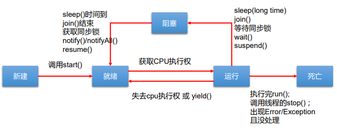
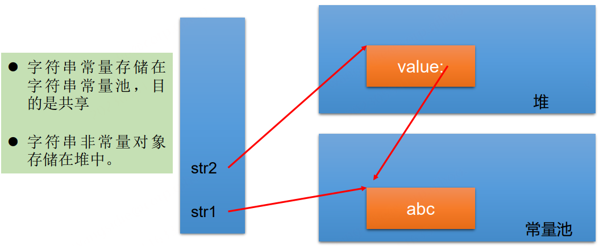
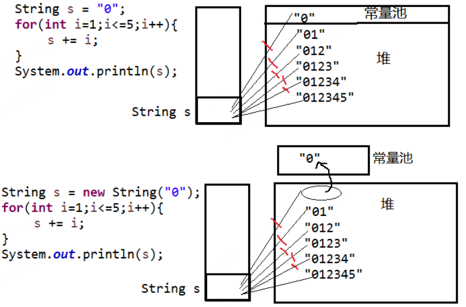
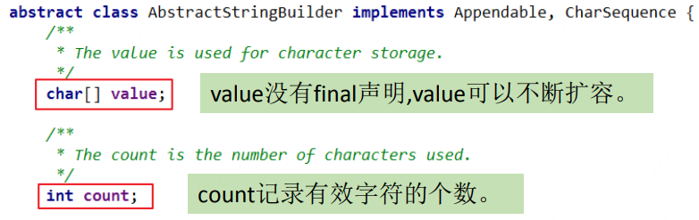
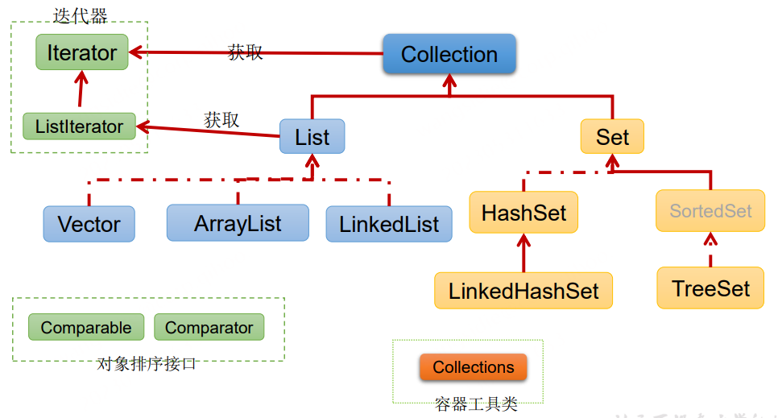
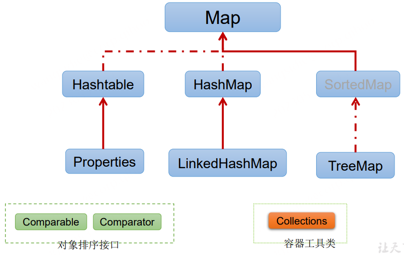
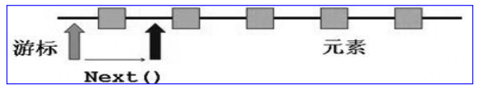
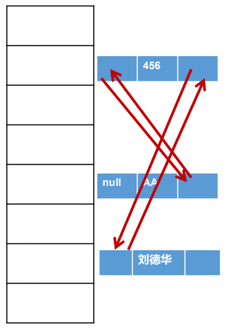
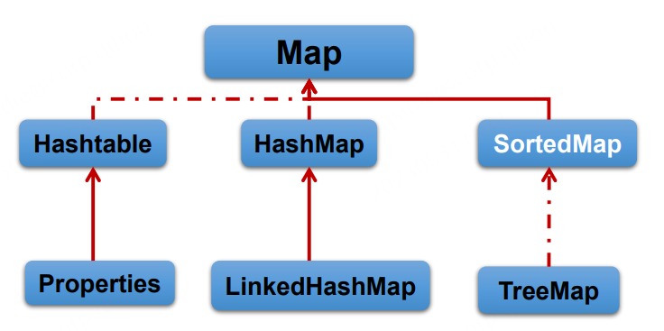
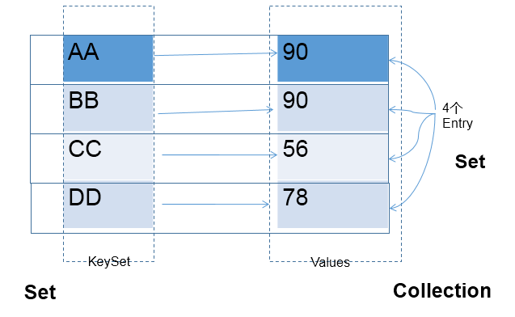

# Java高级学习笔记

## 1. 多线程

### 1.1 基本概念：程序、进程、线程

1. 程序(programm)
   概念：是为完成特定任务、用某种语言编写的一组指令的集合。即指一段静态的代码。
2. 进程(process)
   概念：程序的一次执行过程，或是正在运行的一个程序。
   说明：**进程作为资源分配的单位**，系统在运行时会为每个进程分配不同的内存区域
3. 线程(thread)
   概念：进程可进一步细化为线程，是一个程序内部的一条执行路径。
   说明：**线程作为调度和执行的单位**，每个线程拥独立的运行栈和程序计数器(pc)，线程切换的开销小。
   + 进程可以细化为多个线程。
   + 每个线程，拥有自己独立的：栈、程序计数器
   + 多个线程，共享同一个进程中的结构：方法区、堆。

4. 单核CPU与多核CPU的理解
   + 单核CPU，其实是一种假的多线程，因为在一个时间单元内，也只能执行一个线程的任务。但是因为CPU时间单元特别短，因此感觉不出来。
   + 如果是多核的话，才能更好的发挥多线程的效率。（现在的服务器都是多核的）
   + 一个Java应用程序java.exe，其实至少三个线程：main()主线程，gc()垃圾回收线程，异常处理线程。当然如果发生异常，会影响主线程。

5. 并行与并发的理解
   并行：多个CPU同时执行多个任务。比如：多个人同时做不同的事。
   并发：一个CPU(采用时间片)同时执行多个任务。比如：秒杀、多个人做同一件事

### 1.2 线程的创建和使用

Java语言的JVM允许程序运行多个线程，它通过**java.lang.Thread** 类来体现。 

Thread类的特性 ：

+ 每个线程都是通过某个特定Thread对象的run()方法来完成操作的，经常把run()方法的主体称为线程体
+ 通过该Thread对象的start()方法来启动这个线程，而非直接调用run()

**API中创建线程的两种方式**

+ 继承Thread类的方式 

+ 实现Runnable接口的方式 

**（1）方式一：继承Thread类** 

 >① 定义子类继承Thread类。 
 >
 >② 子类中重写Thread类中的run方法。 
 >
 >③ 创建Thread子类对象，即创建了线程对象。 
 >
 >④ 调用线程对象start方法：启动线程，调用run方法

注意点： 

1. 如果自己手动调用run()方法，那么就只是普通方法，没有启动多线程模式。 
2. run()方法由JVM调用，什么时候调用，执行的过程控制都有操作系统的CPU 调度决定。 
3. 想要启动多线程，必须调用start方法。 
4. 一个线程对象只能调用一次start()方法启动，如果重复调用了，则将抛出以上的异常“IllegalThreadStateException”。

**(2) 方式二：实现Runnable接口** 

> ① 定义子类，实现Runnable接口。
>
> ② 子类中重写Runnable接口中的run方法。
>
> ③ 通过Thread类含参构造器创建线程对象。 
>
> ④ 将Runnable接口的子类对象作为实际参数传递给Thread类的构造器中。
>
> ⑤ 调用Thread类的start方法：开启线程，调用Runnable子类接口的run方法。

**(3) 继承方式和实现方式的联系与区别** 

区别:

+ 继承Thread：线程代码存放Thread子类run方法中。
+ 实现Runnable：线程代码存在接口的子类的run方法。 

实现Runnable方式的好处:

+ 避免了单继承的局限性 
+ 多个线程可以共享同一个接口实现类的对象，非常适合多个相同线程来处理同一份资源

**(4) Thread类中的常用的方法**

* start():启动当前线程；调用当前线程的run()
* run(): 通常需要重写Thread类中的此方法，将创建的线程要执行的操作声明在此方法中
* currentThread():静态方法，返回执行当前代码的线程
* getName():获取当前线程的名字
* setName():设置当前线程的名字
* yield():释放当前cpu的执行权
* join():在线程a中调用线程b的join(),此时线程a就进入阻塞状态，直到线程b完全执行完以后，线程a才结束阻塞状态。
* stop():已过时。当执行此方法时，强制结束当前线程。
* sleep(long millitime):让当前线程“睡眠”指定的millitime毫秒。在指定的millitime毫秒时间内，当前线程是阻塞状态。
* isAlive():判断当前线程是否存活

### 1.3 线程的生命周期



### 1.4 线程的同步

在Java中，我们通过同步机制，来解决线程的安全问题。

#### 1.4.1 Synchronized

(1) Synchronized的使用方法

1. 同步代码块： 

   ```java
   synchronized (对象){ 
   	// 需要被同步的代码； 
   }
   ```

2. synchronized还可以放在方法声明中，表示整个方法为同步方法。

   ```java
    public synchronized void show (String name){  
    		…
    }
   ```

(2) synchronized的锁是什么？

+ 任意对象都可以作为同步锁。所有对象都自动含有单一的锁（监视器）。

+ 同步方法的锁：静态方法（类名.class）、非静态方法（this） 
+ 同步代码块：自己指定，很多时候也是指定为this或类名.class 

注意： 

+ 必须确保使用同一个资源的**多个线程共用一把锁**，这个非常重要，否则就 无法保证共享资源的安全 
+ 一个线程类中的所有静态方法共用同一把锁（类名.class），所有非静态方 法共用同一把锁（this），同步代码块（指定需谨慎）

#### 1.4.2 Lock (锁)

+ 从JDK 5.0开始，Java提供了更强大的线程同步机制——通过显式定义同 步锁对象来实现同步。同步锁使用Lock对象充当。

+ **java.util.concurrent.locks.Lock接口是控制多个线程对共享资源进行访问的工具**。锁提供了对共享资源的独占访问，每次只能有一个线程对Lock对象加锁，线程开始访问共享资源之前应先获得Lock对象.

+ ReentrantLock 类实现了 Lock ，它拥有与 synchronized 相同的并发性和 内存语义，在实现线程安全的控制中，比较常用的是ReentrantLock，可以显式加锁、释放锁。

  ```java
  class A{
  	private final ReentrantLock lock = new ReenTrantLock();
  	public void m(){
  		lock.lock();
  		try{
  			//保证线程安全的代码;
  			}
  		finally{
  			lock.unlock(); 
  		}
  	}
  }
  注意：如果同步代码有异常，要将unlock()写入finally语句块
  ```

#### 1.4.3 synchronized 与 Lock 的对比

1. Lock是显式锁（手动开启和关闭锁，别忘记关闭锁），synchronized是隐式锁，出了作用域自动释放
2. Lock只有代码块锁，synchronized有代码块锁和方法锁 
3. 使用Lock锁，JVM将花费较少的时间来调度线程，性能更好。并且具有更好的扩展性（提供更多的子类） 
4. 优先使用顺序： Lock---> 同步代码块（已经进入了方法体，分配了相应资源）---> 同步方法 （在方法体之外）

### 1.5 线程的通信

**wait() 与 notify() 和 notifyAll()**

+ wait()：令当前线程挂起并放弃CPU、同步资源并等待，使别的线程可访问并修改共享资源，而当前线程排队等候其他线程调用notify()或notifyAll()方法唤醒，唤醒后等待重新获得对监视器的所有权后才能继续执行。 
+ notify()：唤醒正在排队等待同步资源的线程中优先级最高者结束等待
+ notifyAll ()：唤醒正在排队等待资源的所有线程结束等待.

> + 这三个方法只有在synchronized方法或synchronized代码块中才能使用，否则会报 **java.lang.IllegalMonitorStateException**异常。
>
> + 因为这三个方法必须有锁对象调用，而任意对象都可以作为synchronized的同步锁， 因此这三个方法只能在Object类中声明

### 1.6 JDK5.0 新增线程创建方式

#### 1.6.1 新增方式一：实现Callable接口

与使用Runnable相比， Callable功能更强大些:

+ 相比run()方法，可以有返回值 
+ 方法可以抛出异常 
+ 支持泛型的返回值 
+ 需要借助FutureTask类，比如获取返回结果

**Future接口** 

+ 可以对具体Runnable、Callable任务的执行结果进行取消、查询是否完成、获取结果等。 
+ FutrueTask是Futrue接口的唯一的实现类 
+ FutureTask 同时实现了Runnable, Future接口。它既可以作为 Runnable被线程执行，又可以作为Future得到Callable的返回值

```java
//1.创建一个实现Callable的实现类
class NumThread implements Callable{
    //2.实现call方法，将此线程需要执行的操作声明在call()中
    @Override
    public Object call() throws Exception {
        int sum = 0;
        for (int i = 1; i <= 100; i++) {
            if(i % 2 == 0){
                System.out.println(i);
                sum += i;
            }
        }
        return sum;
    }
}


public class ThreadNew {
    public static void main(String[] args) {
        //3.创建Callable接口实现类的对象
        NumThread numThread = new NumThread();
        //4.将此Callable接口实现类的对象作为传递到FutureTask构造器中，创建FutureTask的对象
        FutureTask futureTask = new FutureTask(numThread);
        //5.将FutureTask的对象作为参数传递到Thread类的构造器中，创建Thread对象，并调用start()
        new Thread(futureTask).start();

        try {
            //6.获取Callable中call方法的返回值
            //get()返回值即为FutureTask构造器参数Callable实现类重写的call()的返回值。
            Object sum = futureTask.get();
            System.out.println("总和为：" + sum);
        } catch (InterruptedException e) {
            e.printStackTrace();
        } catch (ExecutionException e) {
            e.printStackTrace();
        }
    }
}
```

#### 1.6.2 新增方式二：使用线程池

**好处：** 

+ 提高响应速度（减少了创建新线程的时间） 
+ 降低资源消耗（重复利用线程池中线程，不需要每次都创建） 
+ 便于线程管理

​		corePoolSize：核心池的大小

​		maximumPoolSize：最大线程数

​		keepAliveTime：线程没任务时最多保持多长时间后会终止

​		......

**线程池相关API**

JDK 5.0起提供了线程池相关API：**ExecutorService** 和 **Executors**

(1) ExecutorService：真正的线程池接口。常见子类ThreadPoolExecutor

```
void execute(Runnable command) ：执行任务/命令，没有返回值，一般用来执行 Runnable 
Future submit(Callable task)：执行任务，有返回值，一般又来执行 Callable
void shutdown() ：关闭连接池 
```

(2) Executors：工具类、线程池的工厂类，用于创建并返回不同类型的线程池

```
Executors.newCachedThreadPool()：创建一个可根据需要创建新线程的线程池 
Executors.newFixedThreadPool(n); 创建一个可重用固定线程数的线程池 
Executors.newSingleThreadExecutor() ：创建一个只有一个线程的线程池 
Executors.newScheduledThreadPool(n)：创建一个线程池,它可安排在给定延迟后运行命令或者定期地执行。 
```

```java
class NumberThread implements Runnable{

    @Override
    public void run() {
        for(int i = 0;i <= 100;i++){
            if(i % 2 == 0){
                System.out.println(Thread.currentThread().getName() + ": " + i);
            }
        }
    }
}

class NumberThread1 implements Runnable{

    @Override
    public void run() {
        for(int i = 0;i <= 100;i++){
            if(i % 2 != 0){
                System.out.println(Thread.currentThread().getName() + ": " + i);
            }
        }
    }
}

public class ThreadPool {

    public static void main(String[] args) {
        //1. 提供指定线程数量的线程池
        ExecutorService service = Executors.newFixedThreadPool(10);
        ThreadPoolExecutor service1 = (ThreadPoolExecutor) service;
        //设置线程池的属性
//        System.out.println(service.getClass());
//        service1.setCorePoolSize(15);
//        service1.setKeepAliveTime();


        //2.执行指定的线程的操作。需要提供实现Runnable接口或Callable接口实现类的对象
        service.execute(new NumberThread());//适合适用于Runnable
        service.execute(new NumberThread1());//适合适用于Runnable

//        service.submit(Callable callable);//适合使用于Callable
        //3.关闭连接池
        service.shutdown();
    }
}
```

## 2. Java常用类

### 2.1 字符串相关的类

#### 2.1.1 String

**(1) String 概述**

+ String:字符串，使用一对""引起来表示。
+ String声明为final的，不可被继承
+ String实现了Serializable接口：表示字符串是支持序列化的。       
+  实现了Comparable接口：表示String可以比较大小
+ String内部定义了final char[] value用于存储字符串数据
+ 通过字面量的方式（区别于new给一个字符串赋值，此时的字符串值声明在字符串常量池中)。
+ 字符串常量池中是不会存储相同内容(使用String类的equals()比较，返回true)的字符串的。

```java
public final class String
	implements java.io.Serializable, Comparable<String>, CharSequence {
		/** The value is used for character storage. */
		private final char value[];
		/** Cache the hash code for the string */
		private int hash; // Default to 0
```

**(2) String的不可变性**
**说明:**

1. 当对字符串重新赋值时，需要重写指定内存区域赋值，不能使用原有的value进行赋值。
2. 当对现的字符串进行连接操作时，也需要重新指定内存区域赋值，不能使用原有的value进行赋值。
3. 当调用String的replace()方法修改指定字符或字符串时，也需要重新指定内存区域赋值，不能使用原有的value进行赋值。

**(3) String实例化的不同方式**
方式说明:

+ 方式一：通过字面量定义的方式
+ 方式二：通过new + 构造器的方式

```java
//通过字面量定义的方式：此时的s1和s2的数据javaEE声明在方法区中的字符串常量池中。
String s1 = "javaEE";
String s2 = "javaEE";
//通过new + 构造器的方式:此时的s3和s4保存的地址值，是数据在堆空间中开辟空间以后对应的地址值。
String s3 = new String("javaEE");
String s4 = new String("javaEE");

System.out.println(s1 == s2);//true
System.out.println(s1 == s3);//false
System.out.println(s1 == s4);//false
System.out.println(s3 == s4);//false
```

> String str1 = “abc”; 与 String str2 = new String(“abc”); 的区别？



**(4) 字符串拼接方式赋值的对比**

1. 常量与常量的拼接结果在常量池。且常量池中不会存在相同内容的常量.
2. 只要其中一个是变量，结果就在堆中。
3. 如果拼接的结果调用intern()方法，返回值就在常量池中

```java
String s1 = "javaEE";
String s2 = "hadoop";

String s3 = "javaEEhadoop";
String s4 = "javaEE" + "hadoop";
String s5 = s1 + "hadoop";
String s6 = "javaEE" + s2;
String s7 = s1 + s2;

System.out.println(s3 == s4);//true
System.out.println(s3 == s5);//false
System.out.println(s3 == s6);//false
System.out.println(s3 == s7);//false
System.out.println(s5 == s6);//false
System.out.println(s5 == s7);//false
System.out.println(s6 == s7);//false

String s8 = s6.intern();//返回值得到的s8使用的常量值中已经存在的“javaEEhadoop”
System.out.println(s3 == s8);//true
****************************
String s1 = "javaEEhadoop";
String s2 = "javaEE";
String s3 = s2 + "hadoop";
System.out.println(s1 == s3);//false

final String s4 = "javaEE";//s4:常量
String s5 = s4 + "hadoop";
System.out.println(s1 == s5);//true
```



**(5) String常用方法**

```java
int length()：返回字符串的长度： return value.length
char charAt(int index)： 返回某索引处的字符return value[index]
boolean isEmpty()：判断是否是空字符串：return value.length == 0
String toLowerCase()：使用默认语言环境，将 String 中的所字符转换为小写
String toUpperCase()：使用默认语言环境，将 String 中的所字符转换为大写
String trim()：返回字符串的副本，忽略前导空白和尾部空白
boolean equals(Object obj)：比较字符串的内容是否相同
boolean equalsIgnoreCase(String anotherString)：与equals方法类似，忽略大小写
String concat(String str)：将指定字符串连接到此字符串的结尾。 等价于用“+”
int compareTo(String anotherString)：比较两个字符串的大小
String substring(int beginIndex)：返回一个新的字符串，它是此字符串的从beginIndex开始截取到最后的一个子字符串。
String substring(int beginIndex, int endIndex) ：返回一个新字符串，它是此字符串从beginIndex开始截取到endIndex(不包含)的一个子字符串。

boolean endsWith(String suffix)：测试此字符串是否以指定的后缀结束
boolean startsWith(String prefix)：测试此字符串是否以指定的前缀开始
boolean startsWith(String prefix, int toffset)：测试此字符串从指定索引开始的子字符串是否以指定前缀开始

boolean contains(CharSequence s)：当且仅当此字符串包含指定的 char 值序列时，返回 true
int indexOf(String str)：返回指定子字符串在此字符串中第一次出现处的索引
int indexOf(String str, int fromIndex)：返回指定子字符串在此字符串中第一次出现处的索引，从指定的索引开始
int lastIndexOf(String str)：返回指定子字符串在此字符串中最右边出现处的索引
int lastIndexOf(String str, int fromIndex)：返回指定子字符串在此字符串中最后一次出现处的索引，从指定的索引开始反向搜索

注：indexOf和lastIndexOf方法如果未找到都是返回-1

替换：
String replace(char oldChar, char newChar)：返回一个新的字符串，它是通过用 newChar 替换此字符串中出现的所 oldChar 得到的。
String replace(CharSequence target, CharSequence replacement)：使用指定的字面值替换序列替换此字符串所匹配字面值目标序列的子字符串。
String replaceAll(String regex, String replacement)：使用给定的 replacement 替换此字符串所匹配给定的正则表达式的子字符串。
String replaceFirst(String regex, String replacement)：使用给定的 replacement 替换此字符串匹配给定的正则表达式的第一个子字符串。
匹配:
boolean matches(String regex)：告知此字符串是否匹配给定的正则表达式。
切片：
String[] split(String regex)：根据给定正则表达式的匹配拆分此字符串。
String[] split(String regex, int limit)：根据匹配给定的正则表达式来拆分此字符串，最多不超过limit个，如果超过了，剩下的全部都放到最后一个元素中。
```

**(6) String与其它结构的转换**

**与基本数据类型、包装类之间的转换:**

>    String --> 基本数据类型、包装类：调用包装类的静态方法：parseXxx(str)
>     基本数据类型、包装类 --> String:调用String重载的valueOf(xxx)

```java
    @Test
    public void test1(){
        String str1 = "123";
//      int num = (int)str1;//错误的
        int num = Integer.parseInt(str1);
        String str2 = String.valueOf(num);//"123"
        String str3 = num + "";
        System.out.println(str1 == str3);
    }
```

**与字符数组之间的转换:**

> String --> char[]:调用String的toCharArray()
> char[] --> String:调用String的构造器

```java
@Test
public void test2(){
    String str1 = "abc123";  //题目： a21cb3

    char[] charArray = str1.toCharArray();
    for (int i = 0; i < charArray.length; i++) {
        System.out.println(charArray[i]);
    }

    char[] arr = new char[]{'h','e','l','l','o'};
    String str2 = new String(arr);
    System.out.println(str2);
}
```

**与字节数组之间的转换**

> 编码：String --> byte[]:调用String的 getBytes()
> 解码：byte[] --> String:调用String的构造器

编码：字符串 -->字节  (看得懂 --->看不懂的二进制数据)
解码：编码的逆过程，字节 --> 字符串 （看不懂的二进制数据 ---> 看得懂

说明：解码时，要求解码使用的字符集必须与编码时使用的字符集一致，否则会出现乱码。

```java
@Test
public void test3() throws UnsupportedEncodingException {
    String str1 = "abc123中国";
    byte[] bytes = str1.getBytes();//使用默认的字符集，进行编码。
    System.out.println(Arrays.toString(bytes));

    byte[] gbks = str1.getBytes("gbk");//使用gbk字符集进行编码。
    System.out.println(Arrays.toString(gbks));

    System.out.println("******************");

    String str2 = new String(bytes);//使用默认的字符集，进行解码。
    System.out.println(str2);

    String str3 = new String(gbks);
    System.out.println(str3);//出现乱码。原因：编码集和解码集不一致！
    String str4 = new String(gbks, "gbk");
    System.out.println(str4);//没出现乱码。原因：编码集和解码集一致！

}
```

#### 2.1.2 StringBuffer类

**(1) 概述**

+  java.lang.StringBuffer代表**可变的字符序列**，JDK1.0中声明，可以对字符 串内容进行增删，此时不会产生新的对象。 
+ 很多方法与String相同。
+ 作为参数传递时，方法内部可以改变值。



+ StringBuffer类不同于String，其对象必须使用构造器生成。有三个构造器： 

  StringBuffer()：初始容量为16的字符串缓冲区 

  StringBuffer(int size)：构造指定容量的字符串缓冲区 

  StringBuffer(String str)：将内容初始化为指定字符串内容

**(2) 常用方法**

```java
StringBuffer append(xxx)：提供了很多的append()方法，用于进行字符串拼接
StringBuffer delete(int start,int end)：删除指定位置的内容
StringBuffer replace(int start, int end, String str)：把[start,end)位置替换为str
StringBuffer insert(int offset, xxx)：在指定位置插入xxx
StringBuffer reverse() ：把当前字符序列逆转
public int indexOf(String str)
public String substring(int start,int end)
public int length()
public char charAt(int n )
public void setCharAt(int n ,char ch)
```

#### 2.1.3 StringBuilder类

+ StringBuilder 和 StringBuffer 非常类似，均代表可变的字符序列，而且 提供相关功能的方法也一样 

**对比String、StringBuffer、StringBuilder** 

> String(JDK1.0)：不可变字符序列 
>
> StringBuffer(JDK1.0)：可变字符序列、效率低、线程安全 StringBuilder(JDK 5.0)：可变字符序列、效率高、线程不安全 
>
> 注意：作为参数传递的话，方法内部String不会改变其值，StringBuffer和StringBuilder 会改变其值。

**与StringBuffer、StringBuilder之间的转换**

> String -->StringBuffer、StringBuilder:调用StringBuffer、StringBuilder构造器
> StringBuffer、StringBuilder -->String:①调用String构造器；②StringBuffer、StringBuilder的toString()

### 2.2 Java比较器

Java实现对象排序的方式有两种：

+ 自然排序：java.lang.Comparable 
+ 定制排序：java.util.Comparator

**方式一：自然排序**：java.lang.Comparable 

+  Comparable接口强行对实现它的每个类的对象进行整体排序。这种排序被称 为类的自然排序。 

+ 实现 Comparable 的类必须实现 **compareTo(Object obj)** 方法，两个对象即 通过 compareTo(Object obj) 方法的返回值来比较大小。

  > 重写compareTo(obj)的规则：
  >  如果当前对象this大于形参对象obj，则返回正整数，
  >  如果当前对象this小于形参对象obj，则返回负整数，
  >   如果当前对象this等于形参对象obj，则返回零。

+  实现Comparable接口的对象列表（和数组）可以通过 **Collections.sort** 或 **Arrays.sort**进行自动排序。实现此接口的对象可以用作有序映射中的键或有序集合中的元素，无需指定比较器。 

+ Comparable 默认都是**从小到大排列**的

```java
class Goods implements Comparable {
	private String name;
	private double price;
	//按照价格，比较商品的大小
	@Override
	public int compareTo(Object o) {
		if(o instanceof Goods) {
			Goods other = (Goods) o;
			if (this.price > other.price) {
				return 1;
			} else if (this.price < other.price) {
				return -1;
			}
		return 0;
		}
		throw new RuntimeException("输入的数据类型不一致");
	}
	//构造器、getter、setter、toString()方法略
}

public class ComparableTest{
	public static void main(String[] args) {
		Goods[] all = new Goods[4];
		all[0] = new Goods("《红楼梦》", 100);
		all[1] = new Goods("《西游记》", 80);
		all[2] = new Goods("《三国演义》", 140);
		all[3] = new Goods("《水浒传》", 120);
		Arrays.sort(all);
		System.out.println(Arrays.toString(all));
	}
}
```

**方式二：定制排序：java.util.Comparator**

+ 当元素的类型没实现java.lang.Comparable接口而又不方便修改代码，或者实现了java.lang.Comparable接口的排序规则不适合当前的操作，那么可以考虑使用 Comparator 的对象来排序
+ 重写compare(Object o1,Object o2)方法，比较o1和o2的大小：
  如果方法返回正整数，则表示o1大于o2；
  如果返回0，表示相等；
  返回负整数，表示o1小于o2。
+ 可以将 Comparator 传递给 sort 方法（如 Collections.sort 或 Arrays.sort），从而允许在排序顺序上实现精确控制。
+ 还可以使用 Comparator 来控制某些数据结构（如有序 set或有序映射）的顺序，或者为那些没有自然顺序的对象 collection 提供排序。

```java
Comparator com = new Comparator() {
    //指明商品比较大小的方式:照产品名称从低到高排序,再照价格从高到低排序
    @Override
    public int compare(Object o1, Object o2) {
        if(o1 instanceof Goods && o2 instanceof Goods){
            Goods g1 = (Goods)o1;
            Goods g2 = (Goods)o2;
            if(g1.getName().equals(g2.getName())){
                return -Double.compare(g1.getPrice(),g2.getPrice());
            }else{
                return g1.getName().compareTo(g2.getName());
            }
        }
        throw new RuntimeException("输入的数据类型不一致");
    }
}
```

## 3. 枚举类与注解

### 3.1 枚举类的使用

#### 3.1.1 枚举类的说明

1. 枚举类的理解：类的对象只有有限个，确定的。我们称此类为枚举类

2. 当需要定义一组常量时，强烈建议使用枚举类

3. 如果枚举类中只一个对象，则可以作为单例模式的实现方式。

4. 枚举类的实现 :

   > JDK1.5之前需要自定义枚举类
   >
   > JDK 1.5 新增的 **enum** 关键字用于定义枚举类

5. 枚举类的属性:

   > + 枚举类对象的属性不应允许被改动, 所以应该使用 **private final** 修饰 
   >
   > + 枚举类的使用 private final 修饰的属性应该在构造器中为其赋值 
   >
   > + 若枚举类显式的定义了带参数的构造器, 则在列出枚举值时也必须对应的传入参数

#### 3.1.2 自定义枚举类

1. **私有化**类的构造器，保证不能在类的外部创建其对象 
2. 在类的内部创建枚举类的实例。声明为：**public static final**  
3. 对象如果有实例变量，应该声明为**private final**，并在构造器中初始化

```java
//自定义枚举类
class Season{
    //1.声明Season对象的属性:private final修饰
    private final String seasonName;
    private final String seasonDesc;

    //2.私化类的构造器,并给对象属性赋值
    private Season(String seasonName,String seasonDesc){
        this.seasonName = seasonName;
        this.seasonDesc = seasonDesc;
    }

    //3.提供当前枚举类的多个对象：public static final的
    public static final Season SPRING = new Season("春天","春暖花开");
    public static final Season SUMMER = new Season("夏天","夏日炎炎");
    public static final Season AUTUMN = new Season("秋天","秋高气爽");
    public static final Season WINTER = new Season("冬天","冰天雪地");

    //4.其他诉求1：获取枚举类对象的属性
    public String getSeasonName() {
        return seasonName;
    }

    public String getSeasonDesc() {
        return seasonDesc;
    }
    //4.其他诉求1：提供toString()
    @Override
    public String toString() {
        return "Season{" +
                "seasonName='" + seasonName + '\'' +
                ", seasonDesc='" + seasonDesc + '\'' +
                '}';
    }
}
```

#### 3.1.3 使用enum定义枚举类

**使用说明** :

+ 使用 enum 定义的枚举类默认继承了 java.lang.Enum类，因此不能再继承其他类 
+ 枚举类的构造器只能使用 private 权限修饰符
+ 枚举类的所有实例必须在枚举类中显式列出(**, 分隔 ; 结尾**)。列出的 实例系统会自动添加 **public static final** 修饰 
+ **必须在枚举类的第一行声明枚举类对象** 
+ JDK 1.5 中可以在 switch 表达式中使用Enum定义的枚举类的对象作为表达式, case 子句可以直接使用枚举值的名字, 无需添加枚举 类作为限定。

```java
//使用enum关键字枚举类
enum Season1 {
    //1.提供当前枚举类的对象，多个对象之间用","隔开，末尾对象";"结束
    SPRING("春天","春暖花开"),
    SUMMER("夏天","夏日炎炎"),
    AUTUMN("秋天","秋高气爽"),
    WINTER("冬天","冰天雪地");

    //2.声明Season对象的属性:private final修饰
    private final String seasonName;
    private final String seasonDesc;

    //2.私化类的构造器,并给对象属性赋值

    private Season1(String seasonName,String seasonDesc){
        this.seasonName = seasonName;
        this.seasonDesc = seasonDesc;
    }

    //4.其他诉求1：获取枚举类对象的属性
    public String getSeasonName() {
        return seasonName;
    }

    public String getSeasonDesc() {
        return seasonDesc;
    }
}

```

#### 3.1.4 Enum类的主要方法

+ values()方法：返回枚举类型的对象数组。该方法可以很方便地遍历所有的 枚举值。 
+ valueOf(String str)：可以把一个字符串转为对应的枚举类对象。要求字符 串必须是枚举类对象的“名字”。如不是，会有运行时异常： IllegalArgumentException。 
+  toString()：返回当前枚举类对象常量的名称

```java
		Season1 summer = Season1.SUMMER;
        //toString():返回枚举类对象的名称
        System.out.println(summer.toString());

//        System.out.println(Season1.class.getSuperclass());
        System.out.println("****************");
        //values():返回所的枚举类对象构成的数组
        Season1[] values = Season1.values();
        for(int i = 0;i < values.length;i++){
            System.out.println(values[i]);
        }
        System.out.println("****************");

        //valueOf(String objName):返回枚举类中对象名是objName的对象。
        Season1 winter = Season1.valueOf("WINTER");
        //如果没objName的枚举类对象，则抛异常：IllegalArgumentException
//        Season1 winter = Season1.valueOf("WINTER1");
        System.out.println(winter);

```

 #### 3.1.5 实现接口的枚举类

```java
interface Info{
    void show();
}

//使用enum关键字枚举类
enum Season1 implements Info{
    //1.提供当前枚举类的对象，多个对象之间用","隔开，末尾对象";"结束
    SPRING("春天","春暖花开"){
        @Override
        public void show() {
            System.out.println("春天在哪里？");
        }
    },
    SUMMER("夏天","夏日炎炎"){
        @Override
        public void show() {
            System.out.println("宁夏");
        }
    },
    AUTUMN("秋天","秋高气爽"){
        @Override
        public void show() {
            System.out.println("秋天不回来");
        }
    },
    WINTER("冬天","冰天雪地"){
        @Override
        public void show() {
            System.out.println("大约在冬季");
        }
    };
    
    //2.声明Season对象的属性:private final修饰
    private final String seasonName;
    private final String seasonDesc;

    //3.私化类的构造器,并给对象属性赋值

    private Season1(String seasonName,String seasonDesc){
        this.seasonName = seasonName;
        this.seasonDesc = seasonDesc;
    }

    //4.其他诉求1：获取枚举类对象的属性
    public String getSeasonName() {
        return seasonName;
    }

    public String getSeasonDesc() {
        return seasonDesc;
    }
}

```

### 3.2 注解的使用

#### 3.2.1 概述

+ 从 JDK 5.0 开始, Java 增加了对元数据(MetaData) 的支持, 也就是 Annotation(注解)
+ Annotation 可以像修饰符一样被使用, 可用于修饰包,类, 构造器, 方 法, 成员变量, 参数, 局部变量的声明, 这些信息被保存在 Annotation  的 “name=value” 对中。

#### 3.2.2 **常见的Annotation示例:**

**示例一：生成文档相关的注解** 

> @author 标明开发该类模块的作者，多个作者之间使用,分割 
>
> @version 标明该类模块的版本 
>
> @see 参考转向，也就是相关主题 
>
> @since 从哪个版本开始增加的 
>
> @param 对方法中某参数的说明，如果没有参数就不能写 
>
> @return 对方法返回值的说明，如果方法的返回值类型是void就不能写 @exception 对方法可能抛出的异常进行说明 ，如果方法没有用throws显式抛出的异常就不能写 其中

```java
package com.annotation.javadoc;
/**
* @author shkstart
* @version 1.0
* @see Math.java
*/
public class JavadocTest {
	/**
	* 程序的主方法，程序的入口
	* @param args String[] 命令行参数
	*/
	public static void main(String[] args) {
	}
	/**
	* 求圆面积的方法
	* @param radius double 半径值
	* @return double 圆的面积
	*/
    public static double getArea(double radius){
        return Math.PI * radius * radius;
	}
}
```

**示例二：在编译时进行格式检查**(JDK内置的三个基本注解) 

> @Override: 限定重写父类方法, 该注解只能用于方法 
>
> @Deprecated: 用于表示所修饰的元素(类, 方法等)已过时。通常是因为 所修饰的结构危险或存在更好的选择
>
> @SuppressWarnings: 抑制编译器警告

**示例三：跟踪代码依赖性**，实现替代配置文件功能

>  Servlet3.0提供了注解(annotation),使得不再需要在web.xml文件中进行Servlet的部署。


## 4. Java集合

### 4.1 Java集合框架概述

Java 集合可分为 Collection 和 Map 两种体系 

**Collection接口**：单列数据，定义了存取一组对象的方法的集合 

+ List：元素有序、可重复的集合 
+ Set：元素无序、不可重复的集合 

 **Map接口**：双列数据，保存具有映射关系“key-value对”的集合





### 4.2 Collection接口方法

1. 添加 
   + add(Object obj) 
   + addAll(Collection coll)

2. 获取有效元素的个数
   +  int size() 
3. 清空集合 
   + void clear() 
4. 是否是空集合 
   + boolean isEmpty() 
5. 是否包含某个元素
   + boolean contains(Object obj)：是通过元素的equals方法来判断是否 是同一个对象 
   + boolean containsAll(Collection c)：也是调用元素的equals方法来比 较的。拿两个集合的元素挨个比较。

6. 删除 
   + boolean remove(Object obj) ：通过元素的equals方法判断是否是要删除的那个元素。只会删除找到的第一个元素 
   + boolean removeAll(Collection coll)：取当前集合的差集
7. 取两个集合的交集 
   + boolean retainAll(Collection c)：把交集的结果存在当前集合中，不 影响c 
8. 集合是否相等 
   + boolean equals(Object obj) 
9. 转成对象数组 
   + Object[] toArray() 
10. 获取集合对象的哈希值
    + hashCode() 
11. 遍历 
    + iterator()：返回迭代器对象，用于集合遍历

```java
Collection集合与数组间的转换
//集合 --->数组：toArray()
Object[] arr = coll.toArray();
for(int i = 0;i < arr.length;i++){
    System.out.println(arr[i]);
}

//拓展：数组 --->集合:调用Arrays类的静态方法asList(T ... t)
List<String> list = Arrays.asList(new String[]{"AA", "BB", "CC"});
System.out.println(list);

List arr1 = Arrays.asList(new int[]{123, 456});
System.out.println(arr1.size());//1

List arr2 = Arrays.asList(new Integer[]{123, 456});
System.out.println(arr2.size());//2
```


### 4.3 Iterator迭代器接口

+ Iterator对象称为迭代器(设计模式的一种)，主要用于遍历 Collection 集合中的元素。
+ Collection接口继承了java.lang.Iterable接口，该接口有一个iterator()方法，那么所 有实现了Collection接口的集合类都有一个iterator()方法，用以返回一个实现了 Iterator接口的对象。 
+ **Iterator 仅用于遍历集合**，Iterator 本身并不提供承装对象的能力。如果需要创建 Iterator 对象，则必须有一个被迭代的集合。 
+ **集合对象每次调用iterator()方法都得到一个全新的迭代器对象**，默认游标都在集合的第一个元素之前。

**Iterator接口的方法:**

> boolean hasNext();
>
> E next();
>
> void remove();



**在调用it.next()方法之前必须要调用it.hasNext()进行检测。若不调用，且 下一条记录无效，直接调用it.next()会抛出NoSuchElementException异常。**

```java
//hasNext():判断是否还有下一个元素
while(iterator.hasNext()){
//next():①指针下移 ②将下移以后集合位置上的元素返回
System.out.println(iterator.next());
}
```

Iterator接口remove()方法:

```java
Iterator iter = coll.iterator();//回到起点
while(iter.hasNext()){
	Object obj = iter.next();
	if(obj.equals("Tom")){
		iter.remove();
	}
}
```

 注意： 

+ Iterator可以删除集合的元素，但是是遍历过程中通过迭代器对象的remove方法，不是集合对象的remove方法。 
+ 如果还未调用next()或在上一次调用 next 方法之后已经调用了 remove 方法， 再调用remove都会报IllegalStateException。

```java
    @Test
    public void test3(){
        Collection coll = new ArrayList();
        coll.add(123);
        coll.add(456);
        coll.add(new Person("Jerry",20));
        coll.add(new String("Tom"));
        coll.add(false);

        //删除集合中"Tom"
        Iterator iterator = coll.iterator();
        while (iterator.hasNext()){
//            iterator.remove();
            Object obj = iterator.next();
            if("Tom".equals(obj)){
                iterator.remove();
            }

        }
        //遍历集合
        iterator = coll.iterator();
        while (iterator.hasNext()){
            System.out.println(iterator.next());
        }
    }

```

使用 foreach 循环遍历集合元素:

```java
@Test
public void test1(){
    Collection coll = new ArrayList();
    coll.add(123);
    coll.add(456);
    coll.add(new Person("Jerry",20));
    coll.add(new String("Tom"));
    coll.add(false);

    //for(集合元素的类型 局部变量 : 集合对象)
    
    for(Object obj : coll){
        System.out.println(obj);
    }
}
说明：
内部仍然调用了迭代器。
```

### 4.4 Collection子接口一：List

1. 存储的数据特点：存储序的、可重复的数据。

2. 常用方法：(记住)
   增：add(Object obj)
   删：remove(int index) / remove(Object obj)
   改：set(int index, Object ele)
   查：get(int index)
   插：add(int index, Object ele)
   长度：size()
   遍历：① Iterator迭代器方式
     ② 增强for循环
     ③ 普通的循环


3. 常用实现类：
List接口：存储序的、可重复的数据。  -->“动态”数组,替换原的数组

+ ArrayList：作为List接口的主要实现类；线程不安全的，效率高；底层使用Object[] elementData存储

+ LinkedList：对于频繁的插入、删除操作，使用此类效率比ArrayList高；底层使用双向链表存储
+ Vector：作为List接口的古老实现类；线程安全的，效率低；底层使用Object[] elementData存储

**(1) List实现类之一：ArrayList**

+ 本质上，ArrayList是对象引用的一个”变长”数组 
+ ArrayList的JDK1.8之前与之后的实现区别？ 
  +  JDK1.7：ArrayList像饿汉式，直接创建一个初始容量为10的数组 
  + JDK1.8：ArrayList像懒汉式，一开始创建一个长度为0的数组，当添加第一个元素时再创建一个始容量为10的数组

+ Arrays.asList(…) 方法返回的 List 集合，既不是 ArrayList 实例，也不是 Vector 实例。 Arrays.asList(…) 返回值是一个固定长度的 List 集合

(2) List实现类之二：LinkedList

+ 对于频繁的插入或删除元素的操作，建议使用LinkedList类，效率较高 
+  新增方法： 
  +  void addFirst(Object obj)
  +  void addLast(Object obj) 
  + Object getFirst() 
  + Object getLast() 
  + Object removeFirst() 
  + Object removeLast()

+ LinkedList：双向链表，内部没有声明数组，而是定义了Node类型的first和last， 用于记录首末元素。同时，定义内部类Node，作为LinkedList中保存数据的基 本结构。Node除了保存数据，还定义了两个变量： 
  + prev变量记录前一个元素的位置 
  + next变量记录下一个元素的位置

**(3) List 实现类之三：Vector** 

+ Vector 是一个古老的集合，JDK1.0就有了。大多数操作与ArrayList 相同，区别之处在于**Vector是线程安全的**。 
+ 在各种list中，最好把ArrayList作为缺省选择。当插入、删除频繁时， 使用LinkedList；Vector总是比ArrayList慢，所以尽量避免使用。 
+ 新增方法： 
  + void addElement(Object obj) 
  +  void insertElementAt(Object obj,int index) 
  + void setElementAt(Object obj,int index) 
  +  void removeElement(Object obj) 
  + void removeAllElements()

**ArrayList和LinkedList的异同:** 

>  二者都线程不安全，相对线程安全的Vector，执行效率高。 此外，ArrayList是实现了基于动态数组的数据结构，LinkedList基于链表的数据结构。对于随机访问get和set，ArrayList觉得优于LinkedList，因为LinkedList要移动指针。对于新增和删除操作add(特指插入)和remove，LinkedList比较占优势，因为ArrayList要移动数据。 

**ArrayList和Vector的区别:** 

> Vector和ArrayList几乎是完全相同的,唯一的区别在于Vector是同步类(synchronized)，属于强同步类。因此开销就比ArrayList要大，访问要慢。正常情况下,大多数的Java程序员使用 ArrayList而不是Vector,因为同步完全可以由程序员自己来控制。Vector每次扩容请求其大小的2倍空间，而ArrayList是1.5倍。Vector还有一个子类Stack。

### 4.5 Collection子接口二：Set

+ Set接口是Collection的子接口，set接口没有提供额外的方法 
+ Set 集合不允许包含相同的元素，如果试把两个相同的元素加入同一个 Set 集合中，则添加操作失败。 
+ Set 判断两个对象是否相同不是使用 == 运算符，而是根据 equals() 方法

**(1) Set实现类之一：HashSet**

①HashSet 具有以下特点： 

+ 不能保证元素的排列顺序
+ HashSet 不是线程安全的
+ 集合元素可以是 **null** 

②**HashSet 集合判断两个元素相等的标准**：两个对象通过 hashCode() 方法比较相等，并且两个对象的 equals() 方法返回值也相等。 

③ 对于存放在Set容器中的对象，**对应的类一定要重写equals()和hashCode(Object  obj)方法，以实现对象相等规则。即：“相等的对象必须具有相等的散列码”。**


**向HashSet中添加元素的过程**： 

+ 当向 HashSet 集合中存入一个元素时，HashSet 会调用该对象的 hashCode() 方法来得到该对象的 hashCode 值，然后根据 hashCode 值，通过某种散列函数决定该对象 在 HashSet **底层数组中**的存储位置。（这个散列函数会与底层数组的长度相计算得到在数组中的下标，并且这种散列函数计算还尽可能保证能均匀存储元素，越是散列分布， 该散列函数设计的越好） 
+ 如果两个元素的hashCode()值相等，会再继续调用equals方法，如果equals方法结果 为true，添加失败；如果为false，那么会保存该元素，但是该数组的位置已经有元素了， 那么会通过**链表的方式**继续链接。
+ 如果两个元素的 equals() 方法返回 true，但它们的 hashCode() 返回值不相等，hashSet 将会把它们存储在不同的位置，但依然可以添加成功。

HashSet 底层也是数组，初始容量为16，当如果使用率超过0.75，（16*0.75=12） 就会扩大容量为原来的2倍。（16扩容为32，依次为64,128....等）

**(2) Set实现类之二：LinkedHashSet** 

+ LinkedHashSet 是 HashSet 的子类 
+ LinkedHashSet 根据元素的 hashCode 值来决定元素的存储位置， 但它同时使用**双向链表**维护元素的次序，这使得元素看起来是以插入**顺序保存**的。 
+ **LinkedHashSet插入性能略低于 HashSet**，但在迭代访问 Set 里的全部元素时有很好的性能。 
+ LinkedHashSet 不允许集合元素重复。

```java
Set set = new LinkedHashSet();
set.add(new String("AA"));
set.add(456);
set.add(456);
set.add(new Customer("刘德华", 1001));
```

LinkedHashSet底层结构:



### 4.6 Map接口



+ Map中的key:无序的、不可重复的，使用Set存储所的key  ---> key所在的类要重写equals()和hashCode() （以HashMap为例)
+ Map中的value:无序的、可重复的，使用Collection存储所的value ->value所在的类要重写equals()
+ 一个键值对：key-value构成了一个Entry对象。
+ Map中的entry:无序的、不可重复的，使用Set存储所的entry



**常用方法**

* 添加：put(Object key,Object value)
* 删除：remove(Object key)
* 修改：put(Object key,Object value)
* 查询：get(Object key)
* 长度：size()
* 遍历：keySet() / values() / entrySet()

```java
Map map = new HashMap();
//map.put(..,..)省略
System.out.println("map的所有key:");
Set keys = map.keySet();// HashSet
for (Object key : keys) {
	System.out.println(key + "->" + map.get(key));
}
System.out.println("map的所有的value：");
Collection values = map.values();
Iterator iter = values.iterator();
while (iter.hasNext()) {
	System.out.println(iter.next());
}
System.out.println("map所有的映射关系：");
// 映射关系的类型是Map.Entry类型，它是Map接口的内部接口
Set mappings = map.entrySet();
for (Object mapping : mappings) {
	Map.Entry entry = (Map.Entry) mapping;
	System.out.println("key是：" + entry.getKey() + "，value是：" + entry.getValue());
}
```

**(1) Map实现类之一：HashMap**

+ 允许使用null键和null值，与HashSet一样，不保证映射的顺序。
+ 所有的key构成的集合是Set:无序的、不可重复的。所以，key所在的类要重写： equals()和hashCode()
+ 一个key-value构成一个entry 
+ 所有的entry构成的集合是Set:无序的、不可重复的
+ HashMap 判断两个 key 相等的标准是：
  + 两个 key 通过 equals() 方法返回 true， hashCode 值也相等
  + HashMap 判断两个 value相等的标准是：两个 value 通过 equals() 方法返回 true。

**HashMap的存储结构**

> JDK 7及以前版本：HashMap是数组+链表结构(即为链地址法)
>
> JDK 8版本发布以后：HashMap是数组+链表+红黑树实现。

**JDK1.8相较于之前的变化：** 

1. HashMap map = new HashMap();//默认情况下，先不创建长度为16的数组 
2. 当首次调用map.put()时，再创建长度为16的数组 
3. 数组为Node类型，在jdk7中称为Entry类型 
4. 形成链表结构时，新添加的key-value对在链表的尾部（七上八下） 
5. 当数组指定索引位置的链表长度>8时，且map中的数组的长度> 64时，此索引位置 上的所有key-value对使用红黑树进行存储。

### 4.7 Collections工具类


#### 


#### 