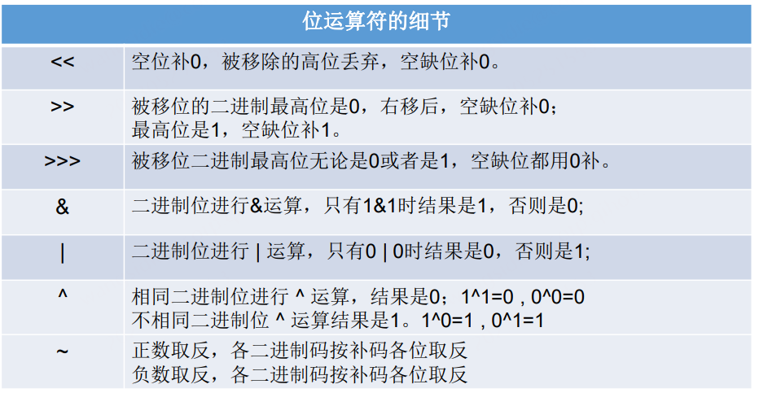
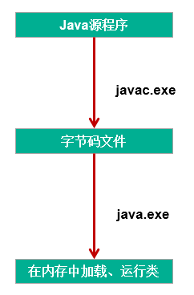
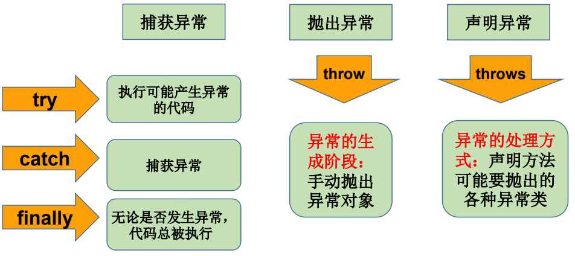

# Java基础学习笔记

## 1. Java基本语法

### 1.1 关键字和保留字

**关键字(keyword)**的定义和特点 

> 定义：被Java语言赋予了特殊含义，用做专门用途的字符串（单词） 
>
> 特点：关键字中所有字母都为小写


**Java保留字**

> 现有Java版本尚未使用，但以后版本可能会作为关键字使用。
> 具体哪些保留字：**goto** 、**const**
> 注意：自己命名标识符时要避免使用这些保留字

### 1.2 标识符

标识符：

> Java 对各种变量、方法和类等要素命名时使用的字符序列称为标识符

定义合法标识符规则：(**必须要遵守**。否则，编译不通过)

>+ 由26个英文字母大小写，0-9 ，_或 $ 组成 
>+ 数字不可以开头。 
>+ 不可以使用关键字和保留字，但能包含关键字和保留字。 
>+ Java中严格区分大小写，长度无限制。 
>+ 标识符不能包含空格。

Java中的名称命名规范：（可以不遵守，不影响编译和运行）

> + 包名：多单词组成时所有字母都小写：xxxyyyzzz 
> + 类名、接口名：多单词组成时，所有单词的首字母大写：XxxYyyZzz 
> + 变量名、方法名：多单词组成时，第一个单词首字母小写，第二个单词开始每个单词首字母大写：xxxYyyZzz 
> + 常量名：所有字母都大写。多单词时每个单词用下划线连接：XXX_YYY_ZZZ

### 1.3 变量

#### 1.3.1 变量分类

（1）按数据类型分类


（2）按声明位置不同分类

+  在方法体外，类体内声明的变量称为**成员变量**。 
+  在方法体内部声明的变量称为**局部变量**。


#### 1.3.2 基本数据类型

|  类型   | 占用存储空间 |       表数范围        |
| :-----: | :----------: | :-------------------: |
|  byte   | 1字节=8bit位 |      -128 ~ 127       |
|  short  |    2字节     |     -2^15~2^15-1      |
|   int   |    4字节     |     -2^31~2^31-1      |
|  long   |    8字节     |     -2^63~2^63-1      |
|  float  |    4字节     |  -3.403E38~3.403E38   |
| double  |    8字节     | -1.798E308~-1.798E308 |
|  char   |    2字节     |                       |
| boolean |     1bit     |     true , false      |

+ Java的整型常量默认为 `int` 型，声明`long`型常量须后加`'l'`或`'L'`

+ Java 的浮点型常量默认为`double`型，声明`float`型常量，须后加`'f'`或`'F'`。
+ `float`表示数值的范围比`long`还大
+ 定义`char`型变量，通常使用一对`''`,内部只能写一个字符
+ `boolean`类型数据只允许取值`true`和`false`，无`null`。

#### 1.3.3 基本数据类型变量间转换

**自动类型转换**：容量小的类型自动转换为容量大的数据类型。数据类型按容量大小排序为：

> byte 、char 、short --> int --> long --> float --> double

+ `byte`,`short`,`char`之间不会相互转换，他们三者在计算时首先转换为 `int` 类型。
+ `boolean`类型不能与其它数据类型运算。 
+ 当把任何基本数据类型的值和字符串`(String)`进行连接运算时`(+)`，基本数据类型的值将自动转化为字符串`(String)`类型。

**强制类型转换**：自动类型提升运算的逆运算。

+ 需要使用强转符：()  // short s1; int i = (int)s1;
+ 注意点：强制类型转换，可能导致精度损失。
+ `boolean`类型不可以转换为其它的数据类型。

#### 1.3.4 基本数据类型与String间转换

+ `String`属于引用数据类型,翻译为：字符串
+ 声明`String`类型变量时，使用一对`""`
+ `String`可以和8种基本数据类型变量做运算，且运算只能是连接运算：`+`

**基本数据类型转String 类型**:

> String 类别中已经提供了将基本数据型态转换成 String 的static 方法，即 String.valueOf()
>
> 例如：
>
> + String.valueOf(double d) : 将 double 变量 d 转换成字符串
>
> + String.valueOf(float f) : 将 float 变量 f 转换成字符串
> + String.valueOf(int i) : 将 int 变量 i 转换成字符串
> + String.valueOf(long l) : 将 long 变量 l 转换成字符串

**String类型转基本数据类型**：

> 通过基本类型的包装了类调用parse xx 方法即可。
>
> 例如：
>
> + Double.parseDouble(String s) : 将 s 转换成 double
> + Float.parseFloat(String s) : 将 s 转换成 float
> + Integer.parseInt(String s) : 将 s 转换成 int

#### 1.3.5 进制与进制间的转换

 对于整数，有四种表示方式： 

+ 二进制(binary)：0,1 ，满2进1.以`0b`或`0B`开头。 
+ 十进制(decimal)：0-9 ，满10进1。 
+ 八进制(octal)：0-7 ，满8进1. 以数字`0`开头表示。 
+ 十六进制(hex)：0-9及A-F，满16进1. 以`0x`或`0X`开头表示。此处的A-F不区分大小写。 如：0x21AF +1= 0X21B0

### 1.4 运算符

#### 1.4.1 算术运算符


#### 1.4.2 赋值运算符

**符号：=**  

+ 当`“=”`两侧数据类型不一致时，可以使用自动类型转换或使用强制类型转换原则进行处理。 
+ 支持连续赋值。

**扩展赋值运算符：**` +=`, `-=`, `*=`, `/=`, `%=`

#### 1.4.3 比较运算符（关系运算符）


+ 比较运算符的结果都是`boolean`型，也就是要么是`true`，要么是`false`。 
+ 比较运算符`“==”`不能误写成`“=”` 。

#### 1.4.4 逻辑运算符

| 符号 | 说明     |
| ---- | -------- |
| &    | 逻辑与   |
| &&   | 短路与   |
| \|   | 逻辑或   |
| \|\| | 短路或   |
| ！   | 逻辑非   |
| ^    | 逻辑异或 |


`“&”`和`“&&”`的区别： 

+ `&`时，左边无论真假，右边都进行运算； 
+ `&&`时，如果左边为真，右边参与运算，如果左边为假，那么右边不参与运算。 

#### 1.4.5 位运算符


位运算是直接对整数的二进制进行的运算



#### 1.4.1 三元运算符

**格式**: `(条件表达式)?表达式1：表达式2`；

+  条件表达式的结果为boolean类型
+  根据条件表达式真或假，决定执行表达式1，还是表达式2.
    如果表达式为true，则执行表达式1。
    如果表达式为false，则执行表达式2。
+  三元运算符可以嵌套使用

+ 表达式1和表达式2为**同种类型**

+  三元运算符与if-else的联系与区别：

   1）三元运算符可简化if-else语句 

   2）三元运算符要求必须返回一个结果。 

   3）if后的代码块可有多个语句

### 1.5 程序流程控制

**流程控制结构：**

流程控制方式采用结构化程序设计中规定的三种基本流程结构，即： 

+ 顺序结构 

  程序从上到下逐行地执行，中间没有任何判断和跳转。

+ 分支结构 

  根据条件，选择性地执行某段代码。 

  有if…else和switch-case两种分支语句。

+ 循环结构

  根据循环条件，重复性的执行某段代码。 

  有while、do…while、for三种循环语句。 

  注：JDK1.5提供了foreach循环，方便的遍历集合、数组元素。

**switch语句有关规则** 

+ switch(表达式)中表达式的值必须是下述几种类型之一：**byte，short， char，int，枚举 (jdk 5.0)，String (jdk 7.0)**； 
+  case子句中的值必须是`常量`，不能是变量名或不确定的表达式值； 
+ 同一个switch语句，所有case子句中的常量值互不相同； 
+ break语句用来在执行完一个case分支后使程序跳出switch语句块；如 果没有break，程序会顺序执行到switch结尾 
+ default子句是**可任选**的。同时，位置也是灵活的。当没有匹配的case时， 执行default。

**特殊流程控制语句说明** 

+ break只能用于`switch语句`和`循环语句`中。 
+ continue 只能用于`循环语句`中。 
+ 二者功能类似，但continue是终止`本次`循环，break是终止`本层`循环。
+ break、continue之后不能有其他的语句，因为程序永远不会执行其后的语句。
+ return：并非专门用于结束循环的，它的功能是结束一个方法。 当一个方法执行到一个return语句时，这个方法将被结束。 
+ 与break和continue不同的是，return直接结束整个方法，不管 这个return处于多少层循环之内

## 2. 数组

### 2.1 数组的概述

+ 数组本身是**引用数据类型**，而数组中的元素可以是任何数据类型，包括基本数据类型和引用数据类型。
+ 创建数组对象会在内存中开辟一整块**连续的空间**，而数组名中引用的是这块连续空间的首地址。
+ 数组的**长度一旦确定，就不能修改**。
+ 可以直接通过下标(或索引)的方式调用指定位置的元素，速度很快。

### 2.2 一维数组的使用

**一维数组的声明与初始化**：

```java
//正确的方式：
int num;//声明
num = 10;//初始化
int id = 1001;//声明 + 初始化

int[] ids;//声明
//1.1 静态初始化:数组的初始化和数组元素的赋值操作同时进行
ids = new int[]{1001,1002,1003,1004};

//1.2动态初始化:数组的初始化和数组元素的赋值操作分开进行
String[] names = new String[5];

int[] arr4 = {1,2,3,4,5};//类型推断

//错误的方式：
//	int[] arr1 = new int[];
//	int[5] arr2 = new int[5];
//	int[] arr3 = new int[3]{1,2,3};
```

**数组的属性：length：**

​		每个数组都有一个属性**length**指明它的长度，例如：**a.length** 指明数组**a**的长度(元素个数)，数组一旦初始化，其长度是不可变的

**一维数组的遍历：**

```java
for(int i = 0;i < names.length;i++){
	System.out.println(names[i]);
}
```

**数组元素的默认初始化值：**

​		数组是引用类型，它的元素相当于**类的成员变量**，因此数组一经分配空间，其中的每个元素也被按照成员变量同样的方式被隐式初始化。

+ **对于基本数据类型而言，默认初始化值各有不同**

+ **对于引用数据类型而言，默认初始化值为null(注意与0不同！）**


### 2.3 多维数组的使用

**二维数组的声明与初始化**

```java
//正确的方式：
int[] arr = new int[]{1,2,3};//一维数组
	//静态初始化
	int[][] arr1 = new int[][]{{1,2,3},{4,5},{6,7,8}};
	//动态初始化1
	String[][] arr2 = new String[3][2];
	//动态初始化2
	String[][] arr3 = new String[3][];
//也是正确的写法：
	int[] arr4[] = new int[][]{{1,2,3},{4,5,9,10},{6,7,8}};
	int[] arr5[] = {{1,2,3},{4,5},{6,7,8}};//类型推断

//错误的方式：
//	String[][] arr4 = new String[][4];
//	String[4][3] arr5 = new String[][];
//	int[][] arr6 = new int[4][3]{{1,2,3},{4,5},{6,7,8}};
```

**二维数组的属性：**

```java
System.out.println(arr4.length);//3
System.out.println(arr4[0].length);//3
System.out.println(arr4[1].length);//4
```

**遍历二维数组元素：**

```java
for(int i = 0;i < arr4.length;i++){
	for(int j = 0;j < arr4[i].length;j++){
		System.out.print(arr4[i][j] + "  ");
	}
	System.out.println();
}
```

**二维数组元素的默认初始化值:**

规定：二维数组分为外层数组的元素，内层数组的元素

```
 int[][] arr = new int[4][3];
 外层元素：arr[0],arr[1]等
 内层元素：arr[0][0],arr[1][2]等
```

数组元素的默认初始化值 ：

针对于初始化方式一：

```
int[][] arr = new int[4][3];
```

 * 	外层元素的初始化值为：地址值
 * 	内层元素的初始化值为：与一维数组初始化情况相同

针对于初始化方式二：

```
int[][] arr = new int[4][];
```

 *   外层元素的初始化值为：null
 *   内层元素的初始化值为：不能调用，否则报错。

### 2.4 Arrays工具类的使用

java.util.Arrays类即为操作数组的工具类，包含了用来操作数组（比如排序和搜索）的各种方法.


### 2.5 数组使用中的常见异常

**数组脚标越界异常(ArrayIndexOutOfBoundsException)**

```java
int[] arr = new int[2];
System.out.println(arr[2]);
System.out.println(arr[-1]);
//访问到了数组中的不存在的脚标时发生。
```

**空指针异常(NullPointerException)**

```java
int[] arr = null;
System.out.println(arr[0]);
//arr引用没有指向实体，却在操作实体中的元素时
```

## 3. 面对对象编程（上）

### 3.1 面向过程和面向对象

二者都是一种思想，面向对象是相对于面向过程而言的。

+ 面向过程，强调的是**功能行为**，以**函数为最小单位**，考虑怎么做。
+ 面向对象，将功能封装进对象，强调具备了功能的对象，**以类/对象为最小单位**，考虑谁来做。

 **面向对象的三大特征**

+ 封装 (Encapsulation)

+ 继承 (Inheritance)

+ 多态 (Polymorphism)

### 3.2 Java基本元素：类和对象

类(Class)和对象(Object)是面向对象的核心概念。

+ 类是对一类事物的描述，是**抽象的**、概念上的定义

+ 对象是**实际存在**的该类事物的每个个体，因而也称为**实例**(instance)

### 3.3 对象的创建和使用

创建对象语法：**类名 对象名= new类名();**

使用 “**对象名.对象成员**” 的方式访问对象成员（包括属性和方法）

### 3.4 类的成员之一：属性

**变量的分类：成员变量与局部变量**

+ 在方法体外，类体内声明的变量称为成员变量。

+ 在方法体内部声明的变量称为局部变量。

**成员变量（属性）和局部变量的区别:**


### 3.5 类的成员之二：方法

#### 3.5.1 方法分类

方法的分类：按照是否有形参及返回值


#### 3.5.2 方法重载

定义：在同一个类中，允许存在一个以上的同名方法，只要它们的参数个数或者参数类型不同即可。

总结："两同一不同":

+ 同一个类、相同方法名 
+ 参数列表不同：参数个数不同，参数类型不同

跟方法的权限修饰符、返回值类型、形参变量名、方法体**都没关系**！

```java
//如下的4个方法构成了重载
	public void getSum(int i,int j){
		System.out.println("1");
	}
	
	public void getSum(double d1,double d2){
		System.out.println("2");
	}
	
	public void getSum(String s ,int i){
		System.out.println("3");
	}
	
	public void getSum(int i,String s){
		System.out.println("4");
	}
```

#### 3.5.3 **可变个数的形参**

1. jdk 5.0新增的内容
2. 具体使用：

+ 声明格式：**方法名(参数的类型名 ...参数名)**
+ 可变参数：方法参数部分指定类型的参数个数是可变多个：0个，1个或多个
+ 可变个数形参的方法与同名的方法之间，彼此构成重载
+ 可变参数方法的使用与方法参数部分使用数组是一致的
+ 方法的参数部分有可变形参，需要放在形参声明的最后
+ 在一个方法的形参位置，最多只能声明一个可变个数形参

3. 举例说明：

```java
public void show(int i){
		
}
	
public void show(String s){
	System.out.println("show(String)");
}
	
public void show(String ... strs){
	System.out.println("show(String ... strs)");
		
	for(int i = 0;i < strs.length;i++){
		System.out.println(strs[i]);
	}
}
//不能与上一个方法同时存在
//	public void show(String[] strs){
//		
//	}
//调用时：
	test.show("hello");
	test.show("hello","world");
	test.show();
```

#### 3.5.4 方法参数的值传递机制

方法，必须由其所在类或对象调用才有意义。若方法含有参数：

+ **形参**：方法声明时的参数

+ **实参：**方法调用时实际传给形参的参数值

Java里方法的参数传递方式只有一种：值传递。 即将实际参数值的副本传入方法内，而参数本身不受影响。

+ 形参是基本数据类型：将实参基本数据类型变量的“数据值”传递给形参

+ 形参是引用数据类型：将实参引用数据类型变量的“地址值”传递给形参

#### 3.5.5 递归方法

递归方法：一个方法体内调用它自身。

方法递归包含了一种隐式的循环，它会重复执行某段代码，但这种重复执行无须循环控制。

```java
// 例1：计算1-n之间所自然数的和
	public int getSum(int n) {// 3
		if (n == 1) {
			return 1;
		} else {
			return n + getSum(n - 1);
		}
	}
```

### 3.7 OOP特征一：封装与隐藏

我们程序设计追求“高内聚，低耦合”。
高内聚 ：类的内部数据操作细节自己完成，不允许外部干涉；
低耦合 ：仅对外暴露少量的方法用于使用。

隐藏对象内部的复杂性，只对外公开简单的接口。便于外界调用，从而提高系统的可扩展性、可维护性。通俗的说，把该隐藏的隐藏起来，该暴露的暴露出来。这就是封装性的设计思想。

### 3.8 类的成员之三：构造器

**构造器的特征**

+ 它具有与类相同的名称

+ 它不声明返回值类型。（与声明为void不同）

+ 不能被static、final、synchronized、abstract、native修饰，不能有return语句返回值

**构造器的作用**：创建对象；给对象进行初始化

**语法格式：**

```java
修饰符 类名 (参数列表) {
	初始化语句；
}
```

**根据参数不同，构造器可以分为如下两类：**

+ 隐式无参构造器（系统默认提供）

+ 显式定义一个或多个构造器（无参、有参）

**注 意：**

+ Java语言中，每个类都至少有一个构造器

+ 默认构造器的修饰符与所属类的修饰符一致

+ 一旦显式定义了构造器，则系统**不再**提供默认构造器

+ 一个类可以创建多个**重载**的构造器

+ 父类的构造器不可被子类继承

**构造器重载举例**

```java
public class Person { 构造器重载举例
	private String name;
	private int age;
	private Date birthDate;
	public Person(String n, int a, Date d) {
		name = n;
		age = a;
		birthDate = d;
	}
	public Person(String n, int a) {
		name = n;
		age = a;
	}
	public Person(String n, Date d) {
		name = n;
		birthDate = d;
	}
	public Person(String n) {
		name = n;
		age = 30;
	}
}
```

**属性赋值过程：**

① 默认初始化

② 显式初始化

③ 构造器中初始化

④ 通过“对象.属性“或“对象.方法”的方式赋值

### 3.9 关键字：this

在Java中，this关键字比较难理解，它的作用和其词义很接近。

+ 它在方法内部使用，即这个方法所属对象的引用；
+ 它在构造器内部使用，表示该构造器正在初始化的对象。

 this 可以调用类的属性、方法和构造器

**注意：**

+ 可以在类的构造器中使用"this(形参列表)"的方式，调用本类中重载的其他的构造器！
+ 明确：构造器中不能通过"this(形参列表)"的方式调用自身构造器

+ 如果一个类中声明了n个构造器，则最多有 n - 1个构造器中使用了"this(形参列表)"

+ "this(形参列表)"必须声明在类的构造器的首行！

+ 在类的一个构造器中，最多只能声明一个"this(形参列表)"，用来调用其他的构造器

## 4. 面对对象编程（中）

### 4.1 OOP特征二：继承性

+ 子类继承了父类，就继承了父类的方法和属性。
+ 在子类中，可以使用父类中定义的方法和属性，也可以创建新的数据和方法。
+ 在Java 中，继承的关键字用的是“extends”，即子类不是父类的子集，而是对父类的“扩展”。
+ Java只支持单继承和多层继承，不允许多重继承

**关于继承的规则：**

**子类不能直接访问父类中私有的(private)的成员变量和方法。**

一旦子类A继承父类B以后，子类A中就获取了父类B中声明的所有的属性和方法。特别的，父类中声明为private的属性或方法，子类继承父类以后，仍然认为获取了父类中私有的结构。只因为封装性的影响，使得子类不能直接调用父类的结构而已。

### 4.2 方法的重写(override)

**定义**：在子类中可以根据需要对从父类中继承来的方法进行改造，也称为方法的重置、覆盖。在程序执行时，子类的方法将覆盖父类的方法。

**要求**：

1. 子类重写的方法**必须**和父类被重写的方法具有相同的**方法名称**、**参数列表**

2. 子类重写的方法的返回值类型**不能大于**父类被重写的方法的返回值类型

3. 子类重写的方法使用的访问权限**不能小于**父类被重写的方法的访问权限

   子类不能重写父类中声明为private权限的方法

4. 子类方法抛出的异常不能大于父类被重写方法的异常

**注意：**

子类与父类中同名同参数的方法必须同时声明为非static的(即为重写)，或者同时声明为static的（不是重写）。因为static方法是属于类的，子类无法覆盖父类的方法。

```java
class Circle{
public double findArea(){}//求面积
}
class Cylinder extends Circle{
public double findArea(){}//求表面积
}
```

### 4.3 四种访问权限修饰符

**Java规定的四种权限修饰符**
 权限从小到大顺序为：private <  缺省 < protected < public
具体的修饰范围：


权限修饰符可用来修饰的结构说明：
4种权限都可以用来修饰类的内部结构：属性、方法、构造器、内部类
修饰类的话，只能使用：缺省、public

### 4.4 关键字：super

在Java类中使用super来调用父类中的指定操作：

+ super可用于访问父类中定义的属性

+ super可用于调用父类中定义的成员方法
+ super可用于在子类构造器中调用父类的构造器

**注意：**

+ 尤其当子父类出现同名成员时，可以用super表明调用的是父类中的成员
+ super的追溯不仅限于直接父类
+ super和this的用法相像，this代表本类对象的引用，super代表父类的内存空间的标识

示例：

```java
class Person {
	protected String name = "张三";
	protected int age;
	public String getInfo() {
		return "Name: " + name + "\nage: " + age;
	}
}
class Student extends Person {
	protected String name = "李四";
	private String school = "New Oriental";
	public String getSchool() {
		return school;
	}
	public String getInfo() {
		return super.getInfo() + "\nschool: " + school;
	}
}
public class StudentTest {
	public static void main(String[] args) {
		Student st = new Student();
		System.out.println(st.getInfo());
	}
}
```

**调用父类的构造器**

+ 子类中所有的构造器**默认**都会访问父类中**空参数**的构造器
+ 当父类中没有空参数的构造器时，子类的构造器必须通过**this(参数列表)**或者**super(参数列表)**语句指定调用本类或者父类中相应的构造器。同时，只能”二选一” ，且必须放在构造器的首行

+ 如果子类构造器中既未显式调用父类或本类的构造器，且父类中又没有无参的构造器，则**编译出错**

**this和super的区别:**


### 4.5 OOP特征三：多态性 

对象的多态性：父类的引用指向子类的对象

```java
Person p = new Man();
Object obj = new Date();
```

多态性的使用：虚拟方法调用

> 有了对象的多态性以后，我们在编译期，只能调用父类中声明的方法，但在运行期，我们实际执行的是子类重写父类的方法。
> 总结：编译，看左边；运行，看右边。

多态性的使用前提：① 类的继承关系  ② 方法的重写

**instanceof** **操作符**

**x instanceof A**：检验x是否为类A的对象，返回值为boolean型。

+ 要求x所属的类与类A必须是子类和父类的关系，否则编译错误。

+ 如果x属于类A的子类B，x instanceof A值也为true

```java
public class Person extends Object {…}
public class Student extends Person {…}
public class Graduate extends Person {…}
-------------------------------------------------------------------
public void method1(Person e) {
	if (e instanceof Person) 
	// 处理Person类及其子类对象
	if (e instanceof Student) 
	//处理Student类及其子类对象
	if (e instanceof Graduate)
	//处理Graduate类及其子类对象
}
```

**对象类型转换** **(Casting )**

+ 基本数据类型的Casting：

> **自动类型转换**：小的数据类型可以自动转换成大的数据类型。
>
> ​	如long g=20; double d=12.0f；
>
> **强制类型转换：**可以把大的数据类型强制转换(casting)成小的数据类型。
>
> 如 float f=(float)12.0; int a=(int)1200L

+ 对Java对象的强制类型转换称为造型：

> 从子类到父类的类型转换可以自动进行
>
> 从父类到子类的类型转换必须通过造型(强制类型转换)实现
>
> **无继承关系的引用类型间的转换是非法的**
>
> 在造型前可以使用**instanceof**操作符测试一个对象的类型

```java
public class Test {
	public void method(Person e) { // 设Person类中没有	getschool() 方法
// System.out.pritnln(e.getschool()); //非法,编译时错误
		if (e instanceof Student) {
			Student me = (Student) e; // 将e强制转换为Student类型
			System.out.pritnln(me.getschool());
		}
	}
	public static void main(String[] args){
		Test t = new Test();
		Student m = new Student();
		t.method(m);
	}
}
```

### 4.6 Object类的使用

+ Object类是所有Java类的根父类
+ 如果在类的声明中未使用extends关键字指明其父类，则默认父类为java.lang.Object类


### 4.7 包装类的使用

针对八种基本数据类型定义相应的引用类型—包装类（封装类）


**（1）基本数据类型包装成包装类的实例 ---装箱** 

+ 通过包装类的构造器实现： int i = 500; Integer t = new Integer(i); 

+ 还可以通过字符串参数构造包装类对象： 

  Float f = new Float(“4.56”); 

  Long l = new Long(“asdf”); //NumberFormatException 

**（2）获得包装类对象中包装的基本类型变量 ---拆箱** 

+ 调用包装类的.xxxValue()方法： boolean b = bObj.booleanValue(); 

 **（3）JDK1.5之后，支持自动装箱，自动拆箱。但类型必须匹配。**

**（4）字符串转换成基本数据类型**

+ 通过包装类的构造器实现： int i = new Integer(“12”); 

+ 通过包装类的parseXxx(String s)静态方法： 

  Float f = Float.parseFloat(“12.1”); 

**（5）基本数据类型转换成字符串**

+ 调用字符串重载的valueOf()方法： 

  String fstr = String.valueOf(2.34f);

+ 更直接的方式： String intStr = 5 + “”

**基本类型、包装类与String类间的转换**


## 5. 面对对象编程（下）

### 5.1 关键字：static

使用范围：在Java类中，可用static修饰属性、方法、代码块、内部类 

被修饰后的成员具备以下特点： 

+ 随着类的加载而加载
+ 优先于对象存在 
+ 修饰的成员，被所有对象所共享
+ 访问权限允许时，可不创建对象，直接被类调用

**（1）static修饰属性：静态变量（或类变量）**
 属性，是否使用static修饰，又分为：静态属性  vs 非静态属性(实例变量)

 * 		   实例变量：我们创建了类的多个对象，每个对象都独立的拥有一套类中的非静态属性。当修改其中一个对象中的非静态属性时，不会导致其他对象中同样的属性值的修改。
 * 		   静态变量：我们创建了类的多个对象，多个对象共享同一个静态变量。当通过某一个对象修改静态变量时，会导致其他对象调用此静态变量时，是修改过了的。

 static修饰属性的其他说明：

+ 静态变量随着类的加载而加载。可以通过"类.静态变量"的方式进行调用

+  静态变量的加载要早于对象的创建。

+  由于类只会加载一次，则静态变量在内存中也只会存在一份：存在方法区的静态域中。

静态属性举例：System.out; Math.PI;

**（2）static修饰方法：静态方法、类方法**

+ 随着类的加载而加载，可以通过"类.静态方法"的方式进行调用
+ 静态方法中，只能调用静态的方法或属性
+ 非静态方法中，既可以调用非静态的方法或属性，也可以调用静态的方法或属性

 **static的注意点：**

+ 在静态的方法内，不能使用this关键字、super关键字

**单例模式：**

​		所谓类的单例设计模式，就是采取一定的方法保证在整个的软件系统中，对某个类**只能存在一个对象实例**，并且该类只提供一个取得其对象实例的方法。 如果我们要让类在一个虚拟机中只能产生一个对象，我们首先必须**将类的构造器的访问权限设置为private**，这样，就不能用new操作符在类的外部产生 类的对象了，但在类内部仍可以产生该类的对象。因为在类的外部开始还无法得到类的对象，只能**调用该类的某个静态方**法以返回类内部创建的对象， 静态方法只能访问类中的静态成员变量，所以，指向类内部产生的**该类对象的变量也必须定义成静态的**。

```java
public class Singleton {
	 /* 持有私有静态实例，防止被引用，此处赋值为 null，目的是实现延迟加载 */
	private static Singleton instance = null;

	/* 私有构造方法，防止被实例化 */
	private Singleton() {
 	}

	/* 静态工程方法，创建实例 */
    public static Singleton getInstance() {
		if (instance == null) {
			synchronized (instance) {
				if (instance == null) {
					instance = new Singleton();
				}
			}
		}
		return instance;
	}

	/* 如果该对象被用于序列化，可以保证对象在序列化前后保持一致 */
	public Object readResolve() {
		return instance;
	}
}
```

### 5.2 理解main方法的语法

+ 由于Java虚拟机需要调用类的main()方法，所以该方法的访问权限必须是 public，又因为Java虚拟机在执行main()方法时不必创建对象，所以该方法必须是static的，该方法接收一个String类型的数组参数，该数组中保存执行Java命令时传递给所运行的类的参数。 
+ 又因为main() 方法是静态的，我们不能直接访问该类中的非静态成员，必须创建该类的一个实例对象后，才能通过这个对象去访问类中的非静态成员。

 * main()方法作为程序的入口
 * main()方法也是一个普通的静态方法
 * main()方法可以作为我们与控制台交互的方式。

### 5.3 类的成员之四：代码块

+ 代码块(或初始化块)的作用： 对Java类或对象进行初始化

+ 代码块(或初始化块)的分类： 一个类中代码块若有修饰符，则只能被static修饰，称为静态代码块 (static block)，没有使用static修饰的，为非静态代码块。
+  static代码块通常用于初始化static的属性

 **静态代码块**：用static 修饰的代码块

+ 可以有输出语句。
+ 可以对类的属性、类的声明进行初始化操作。 
+ 不可以对非静态的属性初始化。即：不可以调用非静态的属性和方法。 
+ 若有多个静态的代码块，那么按照从上到下的顺序依次执行。 
+ 静态代码块的执行要先于非静态代码块。
+  静态代码块随着类的加载而加载，且只执行一次。

**非静态代码块**：没有static修饰的代码块 

+ 可以有输出语句。
+ 可以对类的属性、类的声明进行初始化操作。 
+ 除了调用非静态的结构外，还可以调用静态的变量或方法。 
+ 若有多个非静态的代码块，那么按照从上到下的顺序依次执行。 
+ 每次创建对象的时候，都会执行一次。且先于构造器执行。

静态初始化块举例:

```java
class Person {
	public static int total;
	static {
		total = 100;
		System.out.println("in static block!");
	}
}
public class PersonTest {
	public static void main(String[] args) {
		System.out.println("total = " + Person.total);
		System.out.println("total = " + Person.total);
	}
}

输出：
	in static block
	total=100
	total=100
```

程序中成员变量赋值的执行顺序:

声明成员变量的默认初始化 --> 显式初始化、多个初始化块依次被执行（同级别下按先后顺序执行）--> 构造器再对成员进行初始化操作 --> 通过”对象.属性”或”对象.方法”的方式，可多次给属性赋值

### 5.4 关键字：final

在Java中声明**类、变量**和**方法**时，可使用关键字final来修饰,表示“最终的”。

+ **final标记的类不能被继承**。提高安全性，提高程序的可读性。 

  String类、System类、StringBuffer类 

+ **final标记的方法不能被子类重写。** 

  比如：Object类中的getClass()。 

+ **final标记的变量(成员变量或局部变量)即称为常量**。名称大写，且只能被赋值一次。 

  + final标记的成员变量必须在声明时或在每个构造器中或代码块中显式赋值，然后才能使用。 

  + final double MY_PI = 3.14

+ static final：全局常量

### 5.5 抽象类与抽象方法

+ 用abstract关键字来修饰一个类，这个类叫做抽象类。 

+ 用abstract来修饰一个方法，该方法叫做抽象方法。

  抽象方法：只有方法的声明，没有方法的实现。以分号结束.

  比如：public abstract void talk(); 

+ 含有抽象方法的类必须被声明为抽象类。

+ 抽象类不能被实例化。抽象类是用来被继承的，抽象类的子类必须重写父类的抽象方法，并提供方法体。若没有重写全部的抽象方法，仍为抽象类。

+ **不能用abstract修饰变量、代码块、构造器；** 

+ **不能用abstract修饰私有方法、静态方法、final的方法、final的类。**

案例：

```java
public abstract class Vehicle{
public abstract double calcFuelEfficiency(); //计算燃料效率的抽象方法
public abstract double calcTripDistance(); //计算行驶距离的抽象方法
}
public class Truck extends Vehicle{
	public double calcFuelEfficiency( ) { //写出计算卡车的燃料效率的具体方法 }
	public double calcTripDistance( ) { //写出计算卡车行驶距离的具体方法 }
}
public class RiverBarge extends Vehicle{
	public double calcFuelEfficiency( ) { //写出计算驳船的燃料效率的具体方法 }
	public double calcTripDistance( ) { //写出计算驳船行驶距离的具体方法}
}
```

注意：抽象类不能实例化 new Vihicle()是非法的

### 5.6 接口(interface) 

接口(interface)是**抽象方法**和**常量值**定义的集合。 

接口的特点： 

+ 用interface来定义。 
+ 接口中的所有成员变量都**默认**是由**public static final**修饰的。 
+ 接口中的所有抽象方法都**默认**是由**public abstract**修饰的。 
+ 接口中**没有构造器**。 
+ 接口采用多继承机制。

接口定义举例:

```java
public interface Runner {
	int ID = 1;
	void start();
	public void run();
	void stop();
}

等价于
public interface Runner {
	public static final int ID = 1;
	public abstract void start();
	public abstract void run();
	public abstract void stop();
}
    
```

**Java 8中关于接口的改进:**

 Java 8中，可以为接口添加静态方法和默认方法。从技术角度来说，这是完全合法的，只是它看起来违反了接口作为一个抽象定义的理念。 

+ 静态方法：使用 **static** 关键字修饰。**可以通过接口直接调用静态方法**，并执行其方法体。
+  默认方法：默认方法使用 **default** 关键字修饰。可以通过实现类对象来调用。 

**接口中的默认方法** 

+ 若一个接口中定义了一个默认方法，而另外一个接口中也定义了一个同名同 参数的方法（不管此方法是否是默认方法），在实现类同时实现了这两个接 口时，会出现：**接口冲突**。 

  解决办法：实现类必须覆盖接口中同名同参数的方法，来解决冲突。

+ 若一个接口中定义了一个默认方法，而父类中也定义了一个同名同参数的非 抽象方法，则不会出现冲突问题。因为此时遵守：**类优先原则**。接口中具有 相同名称和参数的默认方法会被忽略。

接口的应用：代理模式(Proxy)

```java
interface Network {
	public void browse();
	}
	// 被代理类
	class RealServer implements Network {
		@Override
		public void browse() {
			System.out.println("真实服务器上网浏览信息");
		}
}

// 代理类
class ProxyServer implements Network {
	private Network network;
	public ProxyServer(Network network) {
		this.network = network;
	}
	public void check() {
		System.out.println("检查网络连接等操作");
	}
	public void browse() {
		check();
		network.browse();
	}
}

public class ProxyDemo {
	public static void main(String[] args) {
		Network net = new ProxyServer(new
		RealServer());
		net.browse();
	}
}
```

**接口和抽象类之间的对比**:


### 5.7 类的成员之五：内部类

**定义**：Java中允许将一个类A声明在另一个类B中，则类A就是内部类，类B称为外部类.
**内部类的分类**：成员内部类（静态、非静态 ） vs 局部内部类(方法内、代码块内、构造器内)

**（1） 成员内部类**

**成员内部类的理解：**
一方面，作为外部类的成员：

>调用外部类的结构
>
>可以被static修饰
>
>可以被4种不同的权限修饰


另一方面，作为一个类：

> 类内可以定义属性、方法、构造器等
>
> 可以被final修饰，表示此类不能被继承。言外之意，不使用final，就可以被继承
>
> 可以被abstract修饰

如何创建成员内部类的对象？(静态的，非静态的)

```java
//创建静态的Dog内部类的实例(静态的成员内部类):
Person.Dog dog = new Person.Dog();

//创建非静态的Bird内部类的实例(非静态的成员内部类):
//Person.Bird bird = new Person.Bird();//错误的
Person p = new Person();
Person.Bird bird = p.new Bird();
```

如何在成员内部类中调用外部类的结构？

```java
class Person{
	String name = "小明";
	public void eat(){
	}
//非静态成员内部类
	class Bird{
		String name = "杜鹃";
		public void display(String name){
			System.out.println(name);//方法的形参
			System.out.println(this.name);//内部类的属性
			System.out.println(Person.this.name);//外部类的属性
		//Person.this.eat();
		}
	}
}
```

**（2） 局部内部类**

**如何声明局部内部:**

```java
class 外部类{
	方法(){
		class 局部内部类{
		}
	}
	{
		class 局部内部类{
		}
	}
}
```

**如何使用局部内部类** :

+ 只能在声明它的方法或代码块中使用，而且是先声明后使用。除此之外的任何地方都不能使用该类 
+ 但是它的对象可以通过外部方法的返回值返回使用，返回值类型只能是局部内部类的父类或父接口类型

**局部内部类特点：**

+ 内部类仍然是一个独立的类，在编译之后内部类会被编译成独立的.class文件，但是前面冠以外部类的类名和$符号，以及数字编号。
+ 只能在声明它的方法或代码块中使用，而且是先声明后使用。除此之外的任何地方 都不能使用该类。 
+ 局部内部类可以使用外部类的成员，包括私有的。 
+ **局部内部类可以使用外部方法的局部变量，但是必须是final的**。由局部内部类和局部变量的声明周期不同所致。 
+ 局部内部类和局部变量地位类似，不能使用public,protected,缺省,private 
+ 局部内部类不能使用static修饰，因此也不能包含静态成员

成员内部类和局部内部类，在编译以后，都会生成字节码文件。
格式：成员内部类：**外部类$内部类名.class**
            局部内部类：**外部类$数字 内部类名.class**

**（3） 匿名内部类**

匿名内部类不能定义任何静态成员、方法和类，只能创建匿名内部类的一 个实例。一个匿名内部类一定是在new的后面，用其隐含实现一个接口或实现一个类。 

格式： 

```
new 父类构造器（实参列表）|实现接口(){ 
	//匿名内部类的类体部分 
}
```

匿名内部类的特点 ：

+ 匿名内部类必须继承父类或实现接口 
+ 匿名内部类只能有一个对象 
+ 匿名内部类对象只能使用多态形式引用

```java
interface A{
	public abstract void fun1();
}
public class Outer{
	public static void main(String[] args) {
		new Outer().callInner(new A(){
		//接口是不能new但此处比较特殊是子类对象实现接口，只不过没有为对象取名
			public void fun1() {
				System.out.println(“implement for fun1");
			}
		});// 两步写成一步了
	}
            
	public void callInner(A a) {
		a.fun1();
	}
} 
```

## 6. 异常处理

### 6.1 异常概述与异常体系结构

异常的体系结构

java.lang.Throwable

 * |-----java.lang.Error:一般不编写针对性的代码进行处理。

 * |-----java.lang.Exception:可以进行异常的处理

   ​		|------编译时异常(checked)

   ​				|-----IOException

   ​						|-----FileNotFoundException

   ​				|-----ClassNotFoundException

   ​		|------运行时异常(unchecked,RuntimeException)

   ​				|-----NullPointerException

   ​				|-----ArrayIndexOutOfBoundsException

   ​				|-----ClassCastException

   ​				|-----NumberFormatException

   ​				|-----InputMismatchException

   ​				|-----ArithmeticException

   

   蓝色：非受检(unchecked)异常 红色：受检(checked)异常

   

   从程序执行过程，看编译时异常和运行时异常

   编译时异常：执行javac.exe命名时，可能出现的异常
   运行时异常：执行java.exe命名时，出现的异常

   **运行时异常:** 

   + 是指编译器不要求强制处置的异常。一般是指编程时的逻辑错误，是程序 员应该积极避免其出现的异常。**java.lang.RuntimeException**类及它的子 类都是运行时异常。 

   + 对于这类异常，可以不作处理，因为这类异常很普遍，若全处理可能会对程序的可读性和运行效率产生影响。

   **编译时异常:**

   + 是指编译器要求必须处置的异常。即程序在运行时由于外界因素造成的一 般性异常。**编译器要求Java程序必须捕获或声明所有编译时异常**。
   + 对于这类异常，如果程序不处理，可能会带来意想不到的结果。

   

### 6.2 常见异常

```java
//******************以下是运行时异常***************************
	//ArithmeticException
	@Test
	public void test6(){
		int a = 10;
		int b = 0;
		System.out.println(a / b);
	}
	
	//InputMismatchException
	@Test
	public void test5(){
		Scanner scanner = new Scanner(System.in);
		int score = scanner.nextInt();
		System.out.println(score);
		scanner.close();
	}
	
	//NumberFormatException
	@Test
	public void test4(){
		String str = "123";
		str = "abc";
		int num = Integer.parseInt(str);
	}
	
	//ClassCastException
	@Test
	public void test3(){
		Object obj = new Date();
		String str = (String)obj;
	}
	
	//IndexOutOfBoundsException
	@Test
	public void test2(){
		//ArrayIndexOutOfBoundsException
//		int[] arr = new int[10];
//		System.out.println(arr[10]);
		//StringIndexOutOfBoundsException
		String str = "abc";
		System.out.println(str.charAt(3));
	}
	
	//NullPointerException
	@Test
	public void test1(){
		
//		int[] arr = null;
//		System.out.println(arr[3]);
		
		String str = "abc";
		str = null;
		System.out.println(str.charAt(0));
		
	}

	//******************以下是编译时异常***************************
	@Test
	public void test7(){
//		File file = new File("hello.txt");
//		FileInputStream fis = new FileInputStream(file);
//		
//		int data = fis.read();
//		while(data != -1){
//			System.out.print((char)data);
//			data = fis.read();
//		}
//		
//		fis.close();
		
	}
```

### 6.3 异常处理机制一：try-catch-finall

Java提供的是异常处理的**抓抛模型**。

过程一："抛"：程序在正常执行的过程中，一旦出现异常，就会在异常代码处生成一个对应异常类的对象。
 * 并将此对象抛出。

 * 一旦抛出对象以后，其后的代码就不再执行。

 * 关于异常对象的产生：

   ① 系统自动生成的异常对象

   ② 手动的生成一个异常对象，并抛出（throw）

 * 过程二："抓"：可以理解为异常的处理方式：① try-catch-finally  ② throws

```java
try{
  		//可能出现异常的代码
	}catch(异常类型1 变量名1){
 		//处理异常的方式1
	}catch(异常类型2 变量名2){
 		//处理异常的方式2
  	}catch(异常类型3 变量名3){
  		//处理异常的方式3
  	}
  ....
 	 finally{
  		//一定会执行的代码
  	}
```

**说明：**

1. finally是可选的。

2. 使用try将可能出现异常代码包装起来，在执行过程中，一旦出现异常，就会生成一个对应异常类的对象，根据此对象的类型，去catch中进行匹配

3. 一旦try中的异常对象匹配到某一个catch时，就进入catch中进行异常的处理。一旦处理完成，就跳出当前的try-catch结构（在没写finally的情况。继续执行其后的代码）

4. catch中的异常类型如果没子父类关系，则谁声明在上，谁声明在下无所谓。

5. catch中的异常类型如果满足子父类关系，则要求子类一定声明在父类的上面。否则，报错

6. 常用的异常对象处理的方式：

   捕获异常的有关信息： 与其它对象一样，可以访问一个异常对象的成员变量或调用它的方法。 

   ① String  getMessage()： 获取异常信息，返回字符串 

   ② printStackTrace()： 获取异常类名和异常信息，以及异常出现在程序中的位置。返回值void。 

7. 在try结构中声明的变量，再出了try结构以后，就不能再被调用

8. try-catch-finally结构可以嵌套

### 6.4 异常处理机制二：throws

异常处理方式二：
"throws + 异常类型"写在方法的声明处。指明此方法执行时，可能会抛出的异常类型。
一旦当方法体执行时，出现异常，仍会在异常代码处生成一个异常类的对象，此对象满足throws后异常类型时，就会被抛出。异常代码后续的代码，就不再执行！

声明抛出异常举例：

```java
public void readFile(String file) throws FileNotFoundException { 
    …… 
    // 读文件的操作可能产生FileNotFoundException类型的异常 
    FileInputStream fis = new FileInputStream(file); 
   ……
}
```

**对比两种处理方式：**

+ try-catch-finally:真正的将异常给处理掉了。
+ throws的方式只是将异常抛给了方法的调用者。并没真正将异常处理掉。

### 6.5 手动抛出异常：throw

Java异常类对象除在程序执行过程中出现异常时由系统自动生成并抛出，也可根据需要使用人工创建并抛出。

+ 首先要生成异常类对象，然后通过throw语句实现抛出操作(提交给Java运 行环境)。 
+ 可以抛出的异常必须是Throwable或其子类的实例。

```java
class Student{
	private int id;
	public void regist(int id) throws Exception {
		if(id > 0){
			this.id = id;
		}else{
			//手动抛出异常对象
//			throw new RuntimeException("您输入的数据非法！");
//			throw new Exception("您输入的数据非法！");
			throw new MyException("不能输入负数");
		}
	}
	@Override
	public String toString() {
		return "Student [id=" + id + "]";
	}
}
```

**throw 和  throws区别：**
throw 表示抛出一个异常类的对象，生成异常对象的过程。声明在方法体内。
throws 属于异常处理的一种方式，声明在方法的声明处。

### 6.6 用户自定义异常类

如何自定义异常类？

1. 继承于现的异常结构：RuntimeException 、Exception

2. 提供全局常量：serialVersionUID

3. 提供重载的构造器

```java
class MyException extends Exception {
	static final long serialVersionUID = 13465653435L;
	private int idnumber;
	public MyException(String message, int id) {
		super(message);
		this.idnumber = id;
	}
	public int getId() {
		return idnumber;
	}
}

public class MyExpTest {
	public void regist(int num) throws MyException {
		if (num < 0)
			throw new MyException("人数为负值，不合理", 3);
		else
			System.out.println("登记人数" + num);
	}
	public void manager() {
		try {
			regist(100);
		} catch (MyException e) {
			System.out.print("登记失败，出错种类" + e.getId());
		}
		System.out.print("本次登记操作结束");
	}
    
	public static void main(String args[]) {
		MyExpTest t = new MyExpTest();
		t.manager();
	}
}
```



